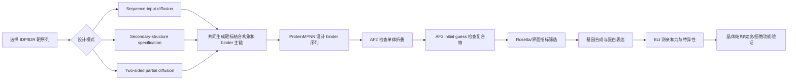

# Diffusing protein binders to intrinsically disordered proteins

> [!info] 论文信息
> - **中文题目**：通过扩散模型设计结合内在无序蛋白的蛋白质结合剂
> - **期刊**：*Nature*，Volume 644，2025
> - **在线发表**：2025 年 7 月 30 日
> - **DOI**：[10.1038/s41586-025-09248-9](https://doi.org/10.1038/s41586-025-09248-9)
> - **英文原文**：[[pdf/s41586-025-09248-9.pdf]]
> - **论文类型**：计算蛋白质设计 + 大量湿实验验证

---

## 0、先用一句话概括

这篇论文改造了 **RFdiffusion**，让模型从一段 IDP/IDR 靶标序列出发，联合生成：

1. 靶标在结合状态下采用的特定构象；
2. 一个能够识别并稳定该构象的、具有稳定折叠结构的蛋白质结合剂。

$$
\boxed{\text{IDP target sequence}}
\xrightarrow{\text{flexible-target RFdiffusion}}
\boxed{\text{bound target conformation + binder backbone}}
\xrightarrow{\text{ProteinMPNN}}
\boxed{\text{binder sequence}}
$$

> [!important] 最容易误解的一点
> 这篇论文**不是**像 IDPFold、STARLING 那样从序列生成自由态 IDP 的平衡构象系综，也没有给每个自由态构象分配概率。它生成的是大量“**候选结合态**”：每个候选中，IDP 取一种能与某个设计结合剂匹配的构象。

所以它在整个 AI–IDP 路线中的位置是：

$$
\text{sequence/ensemble}
\longrightarrow
\text{interaction and binder design}
\longrightarrow
\text{function modulation}
$$

而不是单纯的：

$$
\text{sequence}\longrightarrow\text{free-state ensemble}
$$

---

## 1、研究背景：为什么 IDP 的 binder 很难设计？

### 1.1 普通蛋白质结合剂设计依赖一个相对固定的靶结构

传统结构驱动的 binder design 一般假设靶蛋白有一个已知三维结构：

```text
固定靶结构 → 在其表面生成互补界面 → 设计 binder 序列
```

RFdiffusion 等模型可以围绕固定表面生成形状和化学性质互补的骨架。问题是，IDP/IDR 在游离状态下没有唯一稳定结构：

$$
X_{\mathrm{target}}\neq\text{一个固定坐标文件}
$$

而更接近：

$$
X_{\mathrm{target}}\sim p(X\mid s,\text{environment})
$$

### 1.2 把 IDP 冻结成一个人为结构会产生什么问题？

如果先随意挑一个 IDP 构象，再把它当成固定靶点设计 binder，那么：

- 所选构象可能非常不自然；
- binder 也许只适配这个人为冻结的结构；
- 靶标无法在设计过程中调整构象来形成更好的界面；
- 设计结果容易出现主链冲突、界面空洞或氢键不满足。

因此，这篇论文的核心思想不是“先确定唯一 IDP 结构”，而是：

> **让靶标和 binder 在扩散去噪过程中共同寻找一个相容的结合构象。**

### 1.3 为什么值得做？

IDP/IDR 参与很多传统结构方法难以处理的过程，例如：

- 淀粉样蛋白聚集；
- 转录调控；
- 病毒蛋白相互作用；
- 液–液相分离和应激颗粒；
- 短线性基序介导的瞬时作用。

如果能为这些柔性区域设计高亲和力、高特异性的 binder，就能用它们作为：

- 机制研究探针；
- 检测或富集试剂；
- 抑制聚集或相分离的功能分子；
- 靶向降解、清除或递送模块。

---

## 2、论文真正解决的任务是什么？

### 2.1 输入

主要输入是 IDP/IDR 的一段目标氨基酸序列。论文使用的目标片段来自长度约 **31–941 aa** 的天然无序蛋白或无序区域，但设计时通常围绕其中选定的短靶片段进行。

根据设计模式，还可以额外指定：

- 靶片段倾向形成 α-helix、β-strand 或 loop；
- 一个已有 binder–target 复合物，作为局部改造的起点；
- 扩散时施加多强的噪声。

### 2.2 输出

一次生成得到一个候选复合物：

$$
(X_{\mathrm{target}}^{\mathrm{bound}},X_{\mathrm{binder}})
$$

其中：

- $X_{\mathrm{target}}^{\mathrm{bound}}$：靶 IDR 在这个候选结合态中的构象；
- $X_{\mathrm{binder}}$：设计 binder 的主链骨架。

随后 ProteinMPNN 为 binder 骨架设计氨基酸序列。多次随机采样会产生许多不同候选，但这些候选不是同一个自由态 ensemble 中带有严格统计权重的构象。

### 2.3 它输出概率吗？

不输出“这个靶构象在真实 ensemble 中占 30%”之类的概率。模型的得分、AlphaFold 置信度或筛选排名也不能直接解释为热力学概率。

更准确的理解是：

```text
很多次生成
→ 得到很多可能的结合态设计
→ 计算筛选
→ 合成少量候选
→ 用实验判断是否真正结合
```

---

## 3、完整方法流程



### 3.1 第一阶段：RFdiffusion 生成复合物骨架

原始 RFdiffusion 学习的是：从带噪蛋白坐标逐步恢复合理蛋白结构。此处作者让 target 和 binder 同时参与去噪，使网络寻找：

- 一个能被 binder 包围或配对的靶标构象；
- 一个自身可折叠、同时又与靶标界面互补的 binder 骨架。

### 3.2 第二阶段：ProteinMPNN 设计序列

RFdiffusion 主要给出三维骨架，ProteinMPNN 解决逆折叠问题：

$$
\text{backbone coordinates}\rightarrow\text{amino-acid sequence}
$$

这里主要设计 binder 的序列，使它能够折叠成生成的骨架，并形成所需界面。

### 3.3 第三阶段：AlphaFold 进行自洽性检查

作者并不是把 AlphaFold 当实验真值，而是用它检查两个问题：

1. binder 单独存在时，能否回折到设计骨架；
2. target 与 binder 一起输入时，是否仍预测为预期复合物。

常用指标包括：

- **pLDDT**：局部结构可信度；
- **PAE / pAE interaction**：链间相对位置的不确定性；
- **binder RMSD**：预测结构与设计骨架的偏差。

### 3.4 第四阶段：界面与物理筛选

作者还使用 Rosetta FastRelax 与界面指标排除明显不合理的设计，例如：

- 结合自由能不佳；
- 界面接触面积不足；
- 表面疏水残基暴露；
- 氢键未满足；
- 空间冲突或几何不合理。

每个靶标通常先生成约 $10^4$–$5\times10^4$ 个候选，然后只实验测试其中很小一部分。因此论文的成功不是“一次输入就直接得到最终 binder”，而是生成、筛选、实验验证组成的完整漏斗。

---

## 4、Figure 1：三种设计模式

## 4.1 Figure 1Aa：sequence-input flexible-target diffusion

这是最自由的模式。输入靶标序列，但不提供靶标的固定三维结构，也不规定 binder 的结构和结合方式。

```text
target sequence
      ↓
随机初始化/加噪表示
      ↓
target 与 binder 一起去噪
      ↓
不同轨迹得到不同“靶构象 + binder”候选
```

图中同一条 amylin 序列沿不同采样轨迹，可以形成不同的局部构象，并被不同形状的 binder 识别。这说明模型没有把靶标强制锁死在唯一构象。

但要注意：图中的多个构象不能称为经过实验校准的 amylin 自由态 ensemble。它们是模型为形成可设计界面而提出的不同结合态假设。

### 这种模式的优点

- 对靶结构先验要求最低；
- 可以探索多种结合构象和结合模式；
- 理论上能发现人工难以指定的界面。

### 局限

- 搜索空间非常大；
- 对很短、缺少稳定局部结构的 IDR，成功率可能较低；
- 生成构象是否在自由态中可达，不能只靠模型证明。

---

## 4.2 Figure 1Ab：secondary-structure specification

作者可以只指定靶片段的二级结构类型，例如将它设为 β-strand，但不固定其精确三维坐标。

这不是：

```text
把 target 每个原子的坐标完全固定
```

而是：

```text
告诉模型“这段残基按 β-strand 处理”
但具体弯曲、方向、位置和 binder 几何仍由模型生成
```

对 G3BP1 靶标，指定 target strand 后，通过计算筛选的设计数提高了 **50 倍以上**。原因是 β-strand 提供了明确的主链氢键几何，binder 可以用另一条 β-strand 与其配对，搜索空间显著缩小。

> [!note] 如何评价这种先验
> 它提高了可设计性，但也意味着模型不是完全从序列自主发现所有结构；研究者人为加入了“结合后形成某种二级结构”的假设。

---

## 4.3 Figure 1B：two-sided partial diffusion

这是在已有复合物设计基础上继续优化的方法。

### 普通 one-sided partial diffusion

传统做法可能固定 target，只给 binder 加噪并重新去噪：

$$
X_{\mathrm{target}}=\text{fixed},\qquad
X_{\mathrm{binder}}\rightarrow X_t\rightarrow X_0'
$$

这样 binder 可以改变，但 target 无法响应 binder。

### 本文 two-sided partial diffusion

作者同时给 target 和 binder 的结构加入一定程度的噪声，再让两者共同去噪：

$$
(X_{\mathrm{target}},X_{\mathrm{binder}})
\xrightarrow{\text{partial noising}}
(X_{t}^{T},X_{t}^{B})
\xrightarrow{\text{joint denoising}}
(X_{0}^{T'},X_{0}^{B'})
$$

因此两侧都能发生有限结构调整，既保留原设计的大体拓扑，又允许：

- target 改变局部主链；
- binder 调整界面形状；
- 两侧侧链环境和主链氢键更匹配；
- 从初始命中设计附近搜索更高亲和力方案。

论文使用 50 步扩散流程中的约 **5–25 步**进行部分加噪，并生成约 5,000–50,000 个局部变体。噪声越小，越接近原设计；噪声越大，探索范围越大，但也更可能破坏已有好结构。

> [!important] “two-sided”不是生成两个 binder
> 两侧指复合物的 target 一侧和 binder 一侧都允许变化。

---

## 5、Figure 2：模型是否真的设计出了 binder？

Figure 2 把计算设计模型与 BLI 结合曲线放在一起。BLI 的基本判断是：加入 analyte 后信号上升表示结合，洗脱后下降反映解离；不同浓度曲线可拟合 $K_D$。

| 靶标/设计 | 主要设计方式 | 实验亲和力 $K_D$ | 说明 |
|---|---|---:|---|
| amylin 系列 | sequence-input diffusion | 3.8、10、15、100 nM | 同一序列可被稳定在不同结合构象 |
| C-peptide / CP-35 | sequence-input diffusion | 28 nM | 能识别柔性肽靶标 |
| VP48-2 | sequence-input diffusion | 39 nM | 病毒相关无序区域 |
| BRCA1_ARATH-35 | sequence-input diffusion | 52 nM | 植物蛋白无序靶点 |
| G3BP1-11 | β-strand specification | 11 nM | 后续用于干预应激颗粒 |
| prion / PRI28 | secondary-structure specification | 14 nM | 靶向朊蛋白无序片段 |
| IL-2RG-30 | secondary-structure specification | 97 nM | 识别 IL-2RG 无序区域 |

这些结果说明设计方法不是只对单一序列有效，并且可以得到纳摩尔级 binder。

### FUS 是一个重要的失败/有限成功案例

作者也尝试了 FUS，但得到的最好亲和力约为 **520 nM**，不足以支持后续细胞功能实验。这个结果提醒我们：

- 方法并非对每个 IDP 都稳定成功；
- 计算筛选通过不等于一定有高亲和力；
- 靶标的序列组成、自聚集、构象分布和实验可操作性都会影响结果。

### 特异性

作者对 11 个 binder 和 8 个 target 做了 all-by-all BLI。总体特异性较高，只观察到少量弱交叉结合，例如：

- VP48-2 对 amylin 的弱结合，$K_D>800$ nM；
- G3BP1-11 对 IL-2RG 在约 2 μM 浓度下出现弱信号。

这比“有结合”更重要，因为 IDR 往往富含重复和低复杂度序列，容易出现非特异吸附。

---

## 6、Figure 3：生成结构是否准确？

仅用 BLI 证明结合还不够，因为 binder 可能以与设计完全不同的方式结合。Figure 3 用晶体结构和深度突变扫描验证设计界面。

### 6.1 amylin 复合物晶体结构

作者解析了两个复合物：

- amylin-22：约 1.8 Å 分辨率；
- amylin-18：约 2.0 Å 分辨率。

以其中一个设计为例：

- binder 主链 RMSD：约 0.96 Å；
- 去掉缺失 loop 后的整个复合物 RMSD：约 2.04 Å；
- 界面 Cα RMSD：约 1.33 Å；
- 界面侧链 RMSD：约 1.87 Å。

这说明不仅 binder 自身折叠正确，target 在结合后的局部构象和主要界面也接近设计模型。

### 6.2 G3BP1-11 晶体结构

G3BP1-11 复合物分辨率约 2.4 Å：

- 整个复合物 Cα RMSD：约 0.8 Å；
- 界面 Cα RMSD：约 0.86 Å；
- 界面侧链 RMSD：约 2.29 Å。

这支持“指定 β-strand，让 binder 通过主链氢键配对识别 IDR”的策略。

### 6.3 CP-35 的位点饱和突变

CP-35 没有晶体结构，因此作者系统突变 binder 位点并观察结合变化：

- 界面或疏水核心位置通常不耐受突变；
- 表面非关键位点对突变更宽容。

这种突变图与设计界面吻合，间接说明实际结合模式接近模型，而不是偶然黏附。

### Figure 3 的核心结论

$$
\text{计算模型接近实验复合物结构}
$$

它验证的是**结合态构象和设计界面**，不是自由态 IDP ensemble 的准确性。

---

## 7、Figure 4：binder 能否在真实环境中工作？

## 7.1 细胞内共定位

作者将设计 binder 与全长 target 放入细胞，观察多个体系出现共定位，包括：

- amylin；
- C-peptide；
- VP48；
- IL-2RG；
- G3BP1；
- BRCA1_ARATH。

当 target 界面的关键残基被突变后，共定位减弱或消失，说明信号依赖设计界面，而不只是两种蛋白随机出现在同一区域。

## 7.2 amylin 的捕获与质谱检测

作者把 amylin binder 固定到磁珠上，从复杂样本中富集 amylin，再用 LC–MS/MS 检测。报告的回收率约为：

- 血浆样本：62.2%；
- PBS–CHAPS 加标样本：53.5%。

这说明设计 binder 可以作为分析试剂，而不只是在纯化蛋白体系里产生 BLI 曲线。

## 7.3 G3BP1-11 改变相分离边界

G3BP1 是应激颗粒形成的重要蛋白。G3BP1-11 结合其无序区域并竞争/阻碍 RNA 相关作用，使体系需要更高的 G3BP1 浓度才能发生相分离。

可把相图变化理解为：

$$
\text{binder binding}
\rightarrow
\text{available interaction valency decreases}
\rightarrow
\text{phase separation becomes harder}
$$

在细胞中，G3BP1-11 还能抑制亚砷酸盐诱导的 G3BP1 应激颗粒斑点。

> [!note] 与 IDP 功能研究的关系
> 这一结果把工作从“设计一个会结合的蛋白”推进到了“用 binder 改变 IDR 介导的集体行为”。这正是 ensemble/interaction 到 function 的一步。

---

## 8、Figure 5：抑制聚集并实现细胞清除

### 8.1 抑制 amylin 纤维形成

四种识别不同 amylin 结合构象的 binder，在 **1:4 的 binder:amylin 摩尔比**下即可完全抑制纤维形成。

这说明 binder 不一定要覆盖整个 IDP ensemble；只要抓住聚集路径中的关键单体或中间构象，就可能改变整体动力学。

### 8.2 解聚已经形成的纤维

amylin-36 不仅抑制新纤维形成，还能作用于正在延长或已成熟的纤维。对成熟纤维，论文显示在相应条件下信号随时间显著下降并实现解聚。

可能的机制可以表述为：

1. 纤维端或游离单体与纤维之间存在动态交换；
2. binder 高亲和力捕获可溶性/暴露的 amylin 构象；
3. 平衡被拉向 binder–amylin 复合物；
4. 纤维逐渐失去亚基并解聚。

这里的具体动力学机制仍需进一步实验，不宜仅凭终点曲线下绝对结论。

### 8.3 EndoTag：把靶标送往溶酶体

作者把 amylin binder 与能招募内吞受体的模块融合，构建 EndoTag。它一端抓住 amylin，另一端结合 ASGPR 或 IGF2R 等受体，从而促进：

```text
amylin/binder complex
→ receptor-mediated endocytosis
→ lysosome
→ degradation
```

这把一个从头设计 binder 进一步变成了具有清除功能的工程系统。

---

## 9、这篇论文的核心创新点

### 创新 1：把 IDP 靶构象和 binder 骨架联合生成

传统方法往往把 target 当成固定对象。本文把 target 也放进扩散过程，让结合态构象成为设计变量：

$$
\arg\max_{X_T,X_B,S_B}
\text{foldability}(X_B,S_B)+\text{interface compatibility}(X_T,X_B)
$$

其中 $X_T$ 是 target 结合构象，$X_B$ 是 binder 骨架，$S_B$ 是 binder 序列。

### 创新 2：只指定二级结构而不固定坐标

这是“完全自由”和“完全固定”之间的中间方案：既降低搜索难度，又保留整体几何自由度。

### 创新 3：two-sided partial diffusion

让 target 和 binder 在已有命中附近共同调整，适合从初始设计继续改善界面，而不是只优化固定靶标外侧的 binder。

### 创新 4：从结构验证一直做到功能干预

论文证据链非常完整：

$$
\text{in silico design}
\rightarrow
\text{binding}
\rightarrow
\text{specificity}
\rightarrow
\text{crystal structure}
\rightarrow
\text{cellular function}
$$

尤其展示了：

- 调控 G3BP1 相分离和应激颗粒；
- 抑制/逆转 amylin 聚集；
- 通过 EndoTag 促进靶标清除。

---

## 10、这篇论文没有解决什么？

### 10.1 没有恢复自由态 ensemble 的概率分布

模型生成多个 target 构象，不等于：

$$
\{X_i,w_i\}_{i=1}^{N}
$$

中的 $w_i$ 是真实平衡权重。论文没有用 SAXS、NMR、PRE 等数据系统校准游离 IDP 的总体构象分布。

### 10.2 生成的 target 构象可能是结合诱导/稳定的

晶体结构证明结合态模型准确，但不能证明该构象在自由态中本来就有很高占比。更严谨地说：binder 与 target 的共同设计得到一个可实现的结合态；它可能来自低丰度预存构象，也可能在结合过程中被诱导形成。

### 10.3 仍严重依赖大规模筛选和湿实验

每个靶标生成上万候选，最后只测试一小部分。不同靶标成功率不同，FUS 的有限结果说明仍不存在通用的一键式成功方案。

### 10.4 结构数据库偏置

RFdiffusion/AlphaFold 的知识主要来自 PDB 中可解析的有序结构和复合物，因此可能天然偏向“把无序片段变成规则、紧密的结合态”，而不擅长表达模糊、多价、动态的 fuzzy complex。

### 10.5 没有直接处理完整的环境依赖

真实 IDP 行为受到：

- 离子强度、pH、温度；
- 翻译后修饰；
- RNA、膜和拥挤环境；
- 多组分竞争；
- target 全长上下文

影响。本文设计主要从选定序列片段和结构模型出发，没有显式建模这些条件下的 ensemble 转移。

### 10.6 临床转化问题尚未解决

亲和力和细胞现象并不等于药物可用性。免疫原性、稳定性、组织递送、药代动力学和长期安全性仍需单独研究。

---

## 11、它与 IDPFold、STARLING、GOOSE 的区别

| 工作 | 输入 | 输出 | 主要问题 | 是否给自由态 ensemble |
|---|---|---|---|---|
| IDPFold | IDP 序列 | 多个主链构象 | sequence → ensemble | 是，目标如此 |
| STARLING | IDP 序列 | 快速生成粗粒化构象集合 | sequence → ensemble | 是，目标如此 |
| GOOSE | 期望的 IDR 性质/约束 | 新 IDR 序列 | property → sequence | 否 |
| Generalized IDP design | ensemble/功能目标 | 满足目标的 IDR 序列 | ensemble/function → sequence | 设计侧使用 ensemble |
| 本文 | target 序列/二级结构/初始复合物 | target 结合构象 + folded binder | IDP → interaction/binder/function | **否** |

最关键的衔接关系是：

```text
IDPFold / STARLING
  研究 IDP 自由态可能长什么样
            ↓
本文
  设计一个蛋白去抓住并稳定其中某种可结合构象
            ↓
细胞和功能实验
  检验抓住该构象后会不会改变聚集、相分离或清除
```

因此，如果你的同学已经讲了 STARLING 和 GOOSE，这篇非常适合你讲，因为它不会重复“怎么生成 IDP 本身”，而是自然推进到：

> **知道 IDP 很动态之后，怎样为它设计作用分子，并真正改变功能？**

---

## 12、几个容易混淆的概念

### 12.1 conformational selection 与 induced fit

- **构象选择**：自由态 ensemble 已经短暂出现某个构象，binder 优先结合它；
- **诱导契合**：初始接触后，target 和 binder 继续调整形成最终构象。

本文的联合扩散在计算上允许双方共同适配，但仅从设计和终态结构不能严格区分真实结合动力学属于哪一种机制。最稳妥的说法是：

> 设计 binder 识别并稳定一个特定的 IDP 结合态；该结合态可能涉及构象选择和/或诱导契合。

### 12.2 “diffusing binders”是什么意思？

这里的 diffusion 主要指**生成式扩散模型**，不是说 binder 在溶液里做布朗扩散。模型在坐标空间从噪声逐步去噪，生成蛋白质骨架。

### 12.3 为什么 target 也要参与扩散？

因为它没有唯一固定结构。如果只移动 binder 而冻结 target，相当于人为断言“target 必须长这样”。让 target 一起去噪，模型才有机会找到更相容的结合构象。

### 12.4 晶体结构会不会把 IDP 人为固定？

晶体中看到的是 binder 稳定后的结合态，本来就应该相对有序。它能验证设计的结合几何，但不能代表未结合 IDP 在溶液中的全部状态。

---

## 13、如果只做计算，能从这篇论文学什么？

这篇论文实验占比很高，但计算方向仍有几个明确可研究的问题。

### 13.1 ensemble-aware binder design

先用 STARLING/IDPFold/CALVADOS 生成自由态 ensemble，再研究：

- 设计的结合构象在自由态 ensemble 中是否出现；
- 出现频率与实验亲和力是否相关；
- binder 是否选择低能构象，还是需要付出较大重排代价。

可以构造近似评分：

$$
\Delta G_{\mathrm{effective}}
\approx
\Delta G_{\mathrm{interface}}
+
\Delta G_{\mathrm{conformational\ penalty}}
$$

本文主要优化前者，对后者建模仍不充分。

### 13.2 预测 binder 对 ensemble 的重加权

目标不只是判断“结合/不结合”，而是预测：

$$
p(X\mid s,\text{binder},c)
$$

相对于：

$$
p(X\mid s,c)
$$

如何变化，其中 $c$ 表示环境条件。这个问题能连接构象、相分离和功能。

### 13.3 fuzzy complex 设计与评价

本文更擅长得到一个明确有序的结合态。未来可以研究一个 binder 是否能以多个微观结合模式识别同一 IDR，并用 ensemble-level loss 而不是单结构 RMSD 评价。

### 13.4 计算筛选器改进

可将以下特征结合成更好的成功率预测模型：

- AF2/RF2 复合物置信度；
- 界面能与氢键网络；
- target 构象在自由态 ensemble 中的可及性；
- 非特异黏附倾向；
- binder 自聚集风险；
- 靶标全长上下文中的位点暴露度。

---

## 14、汇报时建议怎么讲？

如果只给这篇论文 4 页，结构可以非常紧凑。

### 第 1 页：问题与核心思想

- 固定靶结构的 binder design 不适合动态 IDP；
- 输入 target sequence；
- 联合生成 bound target conformation + folded binder；
- 强调不是 free-state ensemble generator。

### 第 2 页：Figure 1 三种方法

- sequence-input diffusion；
- secondary-structure specification；
- two-sided partial diffusion；
- 配一张完整计算漏斗图。

### 第 3 页：Figure 2–3，是否结合且结构是否正确

- 纳摩尔级亲和力表格；
- amylin 与 G3BP1 晶体结构 RMSD；
- 特异性与突变验证。

### 第 4 页：Figure 4–5，是否改变功能

- G3BP1 相分离/应激颗粒；
- amylin 聚集抑制和解聚；
- EndoTag 清除；
- 最后指出 ensemble probability、fuzzy binding 和环境依赖仍未解决。

---

## 15、老师可能会问的问题

### Q1：它与 AlphaFold 有什么不同？

AlphaFold 主要预测给定序列的可能结构；本文用 RFdiffusion **生成新的 binder 骨架和结合模式**，再用 ProteinMPNN设计序列，并用 AlphaFold做筛选。

### Q2：一次生成的是一个 ensemble 吗？

不是。一次采样得到一个候选复合物。多次采样得到很多设计候选，但没有经过自由态实验数据约束，也没有真实统计权重，因此不能直接叫平衡 ensemble。

### Q3：为什么能针对无序蛋白设计？

因为 target 坐标不再被固定，而是与 binder 一起在去噪中变化；模型寻找能够形成稳定界面的结合态构象。

### Q4：既然 IDP 很动态，一个 binder 怎么抓住它？

IDP 动态不代表任何构象都不能结合。binder 可以通过界面能稳定某个瞬时可访问或结合后诱导形成的构象，使平衡偏向 binder–target 复合物。

### Q5：最大证据是什么？

不只是 BLI，而是晶体结构与设计模型高度一致，并且 binder 能在细胞和体外改变相分离、应激颗粒及淀粉样聚集。

### Q6：最大不足是什么？

没有显式考虑自由态 ensemble 的概率和构象重排代价，因此无法回答“模型选择的结合构象在天然 ensemble 中有多常见”。

---

## 16、对这篇论文的总体评价

> [!success] 优点
> - 发表在 *Nature*，方法创新与实验验证都很完整；
> - 把生成式蛋白质设计扩展到没有固定结构的靶标；
> - 多靶点获得纳摩尔级 binder；
> - 晶体结构直接验证设计结合态；
> - 从分子结合推进到相分离、聚集和细胞清除功能。

> [!warning] 局限
> - 不是 IDP 自由态 ensemble 模型；
> - 设计构象缺少真实自由态概率；
> - 倾向形成有序、单一的结合态，对 fuzzy complex 表达有限；
> - 计算候选数量大，仍依赖大量实验筛选；
> - 不同靶标成功率不稳定，FUS 结果较弱；
> - 环境、修饰和全长上下文没有被充分建模。

### 最终一句话

这篇论文最重要的意义不是“预测 IDP ensemble”，而是首次较系统地证明：

$$
\boxed{\text{即使靶标没有固定结构，也可以让生成模型共同设计其结合态与高亲和力 binder，并进一步调控功能。}}
$$

它非常适合作为汇报中从 **sequence → ensemble** 过渡到 **ensemble/IDR → interaction → function/design** 的关键论文。
