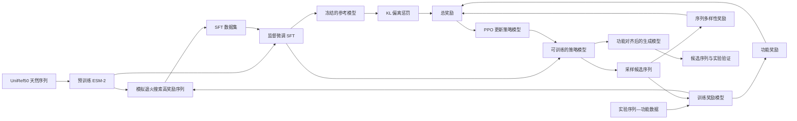
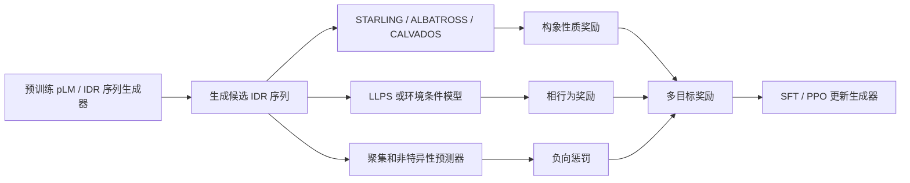

# Functional alignment of protein language models via reinforcement learning

> [!info] 论文信息
> - **中文题目**：利用强化学习对蛋白质语言模型进行功能对齐
> - **期刊**：*Nature Communications*
> - **在线发表**：2026 年 9 月 12 日
> - **DOI**：[10.1038/s41467-026-77557-2](https://doi.org/10.1038/s41467-026-77557-2)
> - **作者**：Nathaniel Blalock、Srinath Seshadri、Kensuke Nakamura 等
> - **代码**：[RomeroLab/RLXF](https://github.com/RomeroLab/RLXF)
> - **模型权重**：[RomeroLab-Duke/creilov-rlxf-esm2-650m](https://huggingface.co/RomeroLab-Duke/creilov-rlxf-esm2-650m)
> - **本地原文**：[[s41467-026-77557-2_reference.pdf]]
> - **论文类型**：蛋白质序列生成 + 强化学习 + 实验验证

---

## 0、一句话概括

这篇论文提出 **RLXF（Reinforcement Learning from eXperimental Feedback）**：先用实验测得的“序列—功能”数据训练一个奖励模型，再用监督微调和 PPO 强化学习，使预训练蛋白质语言模型从“生成像天然蛋白的序列”转向“生成特定功能更强的序列”。

$$
\boxed{\text{预训练蛋白质语言模型}}
\xrightarrow{\text{SFT + PPO，奖励模型提供反馈}}
\boxed{\text{偏向高目标功能的序列生成器}}
$$

> [!important] 最容易误解的一点
> RLXF 并不是在每一次 PPO 更新时都去做一次湿实验。论文先用真实实验数据训练一个**代理奖励模型**，PPO 阶段得到的是奖励模型的预测反馈；最后只对 CreiLOV 的一小批设计进行了真实实验验证。

---

## 1、研究背景：为什么预训练蛋白质语言模型还不够？

### 1.1 蛋白质语言模型真正学到的是什么？

ESM-2 等蛋白质语言模型主要在天然蛋白序列上进行掩码语言建模：

$$
\text{天然序列库}\longrightarrow p_\theta(a_i\mid s_{\setminus i})
$$

它学习的是：

- 哪些氨基酸组合在进化中常见；
- 哪些位点高度保守；
- 哪些替换通常与天然蛋白序列兼容；
- 序列中的局部与长程统计依赖。

这使模型具有很强的**进化先验**，但它的训练目标不是“让荧光最强”“让酶活最高”或“让结合力最大”。

因此：

$$
\text{像天然蛋白}\neq\text{目标工程功能最优}
$$

### 1.2 为什么天然进化目标和工程目标可能冲突？

天然蛋白通常同时承受多种选择压力，例如：

- 保持结构稳定；
- 完成天然生物学功能；
- 避免聚集和错误相互作用；
- 适应细胞环境；
- 控制表达量、代谢成本和降解速度。

工程任务往往只强调一个人为目标。论文中的 CreiLOV 是典型例子：天然序列需要完成光感受器功能，而研究者想要的是尽可能强的荧光。预训练模型会偏爱天然光循环所需要的 Cys43，但工程上已知的 C43A 反而能增强荧光。

### 1.3 现有方法的不足

1. **只从预训练 pLM 采样**：容易停留在天然序列分布附近，不能主动追求非天然功能。
2. **只用奖励模型筛选**：先大量生成再排序，低效；当高功能序列非常稀少时，大量计算被浪费。
3. **只做监督微调**：能模仿已找到的高分序列，但不能持续探索其附近的新组合。
4. **直接最大化预测分数**：可能钻奖励模型的漏洞，产生高预测分数但真实无效的序列。

RLXF 的目标就是把生成模型本身的概率分布移动到高功能区域，而不仅是生成后再筛选。

---

## 2、论文解决的任务是什么？

### 2.1 输入

RLXF 需要三类输入：

1. 一个预训练的蛋白质序列生成模型，如 ESM-2；
2. 某一蛋白家族的实验“序列—功能”数据；
3. 明确的优化目标，例如荧光、结合、酶活或其他可量化性质。

实验数据形式为：

$$
\mathcal D=\{(x_i,y_i)\}_{i=1}^{N}
$$

其中 $x_i$ 是蛋白质序列，$y_i$ 是实验功能值。

### 2.2 输出

输出不是单个蛋白质结构，而是一个**经过功能对齐的序列生成模型**：

$$
\pi_{\theta}^{\mathrm{aligned}}(x)
$$

从它重复采样可以得到许多候选序列，这些序列在奖励模型看来更可能具有目标功能，同时尽量保留原始 pLM 的蛋白质先验和一定的序列多样性。

### 2.3 这篇论文不是在做什么？

- 不是直接预测三维结构；
- 不是生成 IDP 构象集合；
- 不是用强化学习替代实验；
- 不是证明所有高奖励序列都具有高真实功能；
- 不是从零训练一个蛋白质语言模型。

它在整个蛋白质设计链条中的位置是：

```text
天然序列预训练 → 建立功能预测器 → 对齐生成分布 → 生成候选序列 → 独立验证
```

---

## 3、RLXF 的完整数据流



可以分成四步：

1. **训练奖励模型**：把实验数据变成一个可快速调用的功能评分器；
2. **模拟退火生成 SFT 数据**：先寻找一批预测为高功能的序列；
3. **监督微调**：让 pLM 初步进入高功能序列区域；
4. **PPO 强化学习**：在该区域继续探索，并平衡功能、可信度和多样性。

---

## 4、Figure 1：方法框架逐图解释

### 4.1 Figure 1a：什么叫 functional alignment？

图中蓝色曲面表示原始蛋白质语言模型学到的序列分布，高峰对应天然进化中常见的序列区域。红色点表示研究者真正想要的高功能序列。

预训练模型的高概率区域不一定等于高功能区域，因此 RLXF 通过 SFT 和 PPO 将生成概率逐渐移向高功能区域。

重点不是让每个序列都变成同一个最优序列，而是学习一个新的分布：

$$
p_{\mathrm{pretrained}}(x)
\longrightarrow
p_{\mathrm{aligned}}(x\mid \text{desired function})
$$

### 4.2 Figure 1b：预训练、奖励模型和 SFT

#### 预训练

ESM-2 已经从 UniRef50 学到了天然蛋白质序列规律。

#### 奖励模型训练

用实验测量的序列及功能值训练模型：

$$
f_{\phi}(x)\approx y_{\mathrm{experiment}}
$$

此后，$f_\phi(x)$ 就能快速给新序列估计功能分数。

#### SFT

论文先用模拟退火在序列空间中搜索高奖励序列，再把这些序列作为监督微调数据，使 ESM-2 更愿意生成高奖励模式。

SFT 的作用可以理解成：

> 先把模型从巨大的天然序列空间带到一个比较有希望的区域，再让 PPO 做更细的探索。

### 4.3 Figure 1c：PPO 阶段

SFT 后复制出两个模型：

- **Frozen SFT ESM-2**：冻结，作为参考模型；
- **Aligned ESM-2**：继续训练，作为当前策略模型。

对同一批被掩码的序列位点，两个模型都给出氨基酸概率。策略模型根据自身概率采样新氨基酸，形成候选序列，再由奖励模型打分。

冻结模型不是用来生成最终序列，而是用来判断当前模型是否偏离得过远。

---

## 5、奖励模型：RLXF 中真正决定方向的组件

### 5.1 奖励模型干什么？

奖励模型将一条序列映射为功能分数：

$$
x\xrightarrow{f_\phi}\hat y
$$

PPO 并不知道荧光、结合或酶活的物理机制，它只知道：如果某种序列能得到更高奖励，就提高生成这种序列的概率。

因此 RLXF 的上限首先受到奖励模型上限限制：

$$
\text{错误奖励}\Rightarrow\text{错误优化方向}
$$

### 5.2 五个基准蛋白家族

论文先在五个深度突变扫描数据集上评价通用性：

| 蛋白家族 | 优化性质 |
|---|---|
| GB1 | IgG 结合能力 |
| avGFP | 荧光 |
| Ube4B | 泛素连接酶相关活性 |
| Bgl3 | 水解酶活性 |
| Pab1 | poly(A) 结合相关功能 |

这些数据集提供大量突变序列及其测量功能，可训练监督奖励模型。

### 5.3 CreiLOV 奖励模型

CreiLOV 任务使用由 **100 个 MLP 组成的集成模型**：

- 输入：序列的 one-hot 表示；
- 输出：预测的对数平均荧光；
- 不同随机种子训练 100 个成员；
- 损失：均方误差。

训练数据包括：

- 2204 个单突变体；
- 176 个双突变体；
- 978 个三突变体；
- 3565 个四突变体；
- 9603 个五突变体用于验证/测试划分。

论文没有直接使用集成平均值作为奖励，而是使用预测分布的较保守分位数，以降低对高不确定性外推的过度乐观。

### 5.4 奖励模型会犯什么错误？

Pab1 数据中的 Q94C 是重要反例：该突变在原始 DMS 数据中表现为异常高分，RLXF 因而频繁生成它；但它很可能是测量或数据处理造成的假阳性。

这说明：

> RLXF 不会自动区分真实规律和数据伪影，它会非常认真地放大奖励模型认为有利的模式。

这与大语言模型中的 reward hacking 是同一类问题。

---

## 6、第一阶段：SFT 是怎样做的？

### 6.1 为什么不能直接用实验中的少量高分序列？

实验数据通常只覆盖巨大序列空间的一小部分，并且高分样本数量有限。论文先用奖励模型驱动模拟退火，扩充高奖励候选集合。

### 6.2 模拟退火过程

对当前序列提出突变 $x\rightarrow x'$，计算预测功能差：

$$
\Delta f=f_\phi(x')-f_\phi(x)
$$

- 如果 $\Delta f>0$，总是接受；
- 如果 $\Delta f<0$，以概率接受：

$$
P_{\mathrm{accept}}=\exp\left(\frac{\Delta f}{T}\right)
$$

温度 $T$ 从高到低逐渐衰减：前期允许跨越局部低谷，后期集中在高分区域。

论文进行了 100 次独立搜索，每次 50,000 步，最后去重形成高奖励 SFT 数据集。

### 6.3 SFT 训练哪些参数？

ESM-2 的大部分参数被冻结，只训练较少的上层参数，包括：

- 语言模型输出头；
- 最后一个 Transformer block；
- 倒数第二个 block 的 LayerNorm 参数。

这样做是为了：

1. 降低训练成本；
2. 保留预训练得到的蛋白质先验；
3. 减少灾难性遗忘；
4. 防止少量任务数据把整个模型带偏。

### 6.4 SFT 的实际贡献

论文结果显示，很多任务中的主要提升已经来自 SFT。PPO 通常进一步改善或细化分布，但增量并不总是很大。

因此不能简单把论文结论写成“PPO 是全部性能提升的来源”。更准确的是：

$$
\text{模拟退火找高分序列}
+\text{SFT 初始化}
+\text{PPO 探索}
=\text{RLXF}
$$

---

## 7、第二阶段：PPO 到底怎样更新蛋白质语言模型？

### 7.1 状态和动作是什么？

在一个被掩码的位置 $t$：

- 状态 $s_t$：当前部分序列和上下文；
- 动作 $a_t$：在该位置选择一个氨基酸；
- 策略 $\pi_\theta(a_t\mid s_t)$：当前模型给该氨基酸的概率。

蛋白质序列设计因此被表达为一系列残基选择动作。

### 7.2 概率比

当前对齐模型与冻结参考模型对同一氨基酸选择给出的概率比为：

$$
r_t(\theta)=
\frac{\pi_\theta(a_t\mid s_t)}
{\pi_{\mathrm{ref}}(a_t\mid s_t)}
$$

- $r_t>1$：当前模型比参考模型更偏爱该氨基酸；
- $r_t<1$：当前模型降低了该氨基酸的概率；
- $r_t\approx1$：没有明显改变。

### 7.3 PPO clipped objective

PPO 使用截断目标限制单次更新幅度：

$$
L_{\mathrm{clip}}=
\mathbb E_t\left[
\min\left(
r_tA_t,
\operatorname{clip}(r_t,1-\epsilon,1+\epsilon)A_t
\right)
\right]
$$

其中 $A_t$ 表示当前选择相对于基线有多好。clip 操作防止某一次高奖励样本让模型概率突然改变得过大，从而减少训练崩溃和模式坍塌。

论文没有训练独立 critic，而采用同组/亲本序列的奖励基线来估计相对优势，思想上接近 group-relative 的更新。

### 7.4 总奖励由三部分构成

$$
R(x)=
r_{\mathrm{func}}(x)
+\gamma H(x)
-\beta D_{\mathrm{KL}}(x)
$$

#### 1. 功能奖励 $r_{\mathrm{func}}$

奖励模型预测的目标功能，鼓励模型生成高功能序列。

#### 2. 多样性奖励 $H$

用批内序列之间的平均 Hamming distance 鼓励候选不要全部相同：

$$
d_H(x_i,x_j)=\sum_k\mathbb I(x_{ik}\ne x_{jk})
$$

#### 3. KL 惩罚 $D_{\mathrm{KL}}$

限制当前策略过度偏离冻结参考模型：

$$
D_{\mathrm{KL}}(\pi_\theta\|\pi_{\mathrm{ref}})
$$

这相当于提醒模型：追求功能时仍要尊重预训练获得的“什么像蛋白质”的先验。

### 7.5 为什么既要 KL 又要多样性？

两者解决不同问题：

- KL 防止生成模型跑到极端、不可置信的序列区域；
- 多样性奖励防止模型只重复一个高奖励模式。

但 Hamming distance 只是很粗糙的多样性指标：两个序列突变位点很多，并不等于它们结构或功能机制真正不同。

---

## 8、Figure 2：五个家族的基准实验说明什么？

### 8.1 win rate 是什么？

论文把预训练 ESM-2 650M 作为基准，计算某方法生成的序列中有多少比例获得更高的**奖励模型预测分数**：

$$
\mathrm{WinRate}=
\frac{\#\{x:f_\phi(x)>f_\phi(x_{\mathrm{baseline}})\}}
{\#\{x\}}
$$

> [!warning] 这不是实验成功率
> Figure 2 中的主要性能都是奖励模型预测结果，不能直接解释成“这些序列已经在实验中证实功能更强”。

### 8.2 主要结果

论文比较了 8M、35M、150M 和 650M 四种 ESM-2 规模，并比较：

- 预训练模型；
- SFT；
- SFT + PPO。

总体结论是：

1. RLXF 在五个家族和多个模型规模上普遍提高 win rate；
2. 可生成包含多达约 20 个突变且预测性能优于基线的序列；
3. 没有一个模型规模在所有蛋白家族上始终最好；
4. SFT 通常贡献主要增益，PPO 提供进一步但不总是巨大的改善；
5. 最合适的模型规模与蛋白家族的进化数据丰富度和先验校准有关。

### 8.3 模型学到了哪些突变偏好？

论文将 RLXF 的高频突变映射到已知结构和功能信息：

- **GB1**：偏好 V29R 等带正电替换，可能加强与 IgG 界面的静电作用；
- **Ube4B**：D68N、D139N、N142T 等与活性复合物稳定或自泛素化增强有关；
- **avGFP**：V163G、D180E、T108G 与亮度或稳定性相关；
- **Bgl3**：A150D 是已知的热稳定化突变；
- **Pab1**：Q94C 暴露出 DMS 假阳性被模型放大的问题。

这说明 RLXF 可以重新分配单个位点的氨基酸概率，但“与已知有益突变一致”只是合理性证据，不等于证明模型已理解生物物理机制。

### 8.4 低数据量实验

论文进一步只用约 10–100 条带标签变体训练奖励模型。低数据条件下采用较简单的 ridge regression，并加入 TranceptEVE 等进化特征。

结论是：当 pLM 对该家族的先验较可靠时，少量数据也能把生成分布推向更高预测功能；但如果基础模型对该家族的概率校准差，即使奖励模型本身拟合不错，对齐仍可能失败。

影响低样本效果的重要因素包括：

- 家族天然序列数量；
- 有效序列数 $N_{\mathrm{eff}}$；
- 掩码后是否保留野生型氨基酸；
- 概率熵是否异常膨胀；
- 预测的一致性与伪困惑度。

这里的重要观点是：

> 奖励模型回答“往哪里走”，预训练 pLM 决定“能否在附近形成可靠、可生成的序列空间”。

---

## 9、为什么选择 CreiLOV 做真实实验？

### 9.1 CreiLOV 是什么？

CreiLOV 是来源于蓝光受体 LOV domain 的小型、氧不依赖荧光蛋白。它结合 FMN 辅因子，可在缺氧等环境中使用。

但荧光并不是天然 LOV 蛋白的主要生物学目标，因此天然进化先验和“最大荧光”之间存在明显错位，非常适合检验 functional alignment。

### 9.2 预训练模型的偏差

已知：

- C43A 会破坏天然光循环并增强荧光；
- T7S 是 DMS 中最亮的单点突变之一。

多数预训练 ESM 模型仍偏好位置 43 的天然 Cys，说明它们保留的是天然光受体功能相关先验，而不是荧光工程目标。

论文选择基线表现最好的 ESM-2 650M 进行后续对齐，并同时用在大量 CreiLOV 同源序列上训练的 VAE 作为另一种生成器。

---

## 10、Figure 3：CreiLOV 的计算设计结果

### 10.1 对齐后生成分布发生什么变化？

对齐后的 ESM-2 在奖励模型上相对基础模型达到很高的 win rate，并能生成包含多达约 45 个突变的高预测荧光序列。

多维尺度图显示：

- 预训练模型主要停留在天然序列区域；
- SFT 把分布明显推向高荧光区域；
- PPO 在高功能区域内继续集中和探索。

### 10.2 模型反复选择哪些核心突变？

对齐 ESM-2 形成一组较稳定的高置信度偏好：

- R5D；
- T7S；
- G26T；
- C43A；
- K112I。

这些突变被映射到 CreiLOV 结构后，许多位于 FMN 环境附近或可能影响蛋白稳定性和辅因子微环境。

### 10.3 这一图不能证明什么？

Figure 3 主要是在奖励模型和序列空间上的分析，仍可能受到：

- 奖励模型外推误差；
- DMS 数据偏差；
- 高突变数导致的分布外序列；
- 奖励模型与生成模型相互放大的伪相关。

所以必须看 Figure 4 的真实实验。

---

## 11、Figure 4：真实实验是否支持 RLXF？

### 11.1 实验设计

论文共选择 60 条设计序列：

| 生成模型 | 是否对齐 | 突变数 | 数量 |
|---|---:|---:|---:|
| VAE | 否 | 5 | 10 |
| VAE | 是 | 5 | 10 |
| ESM-2 | 否 | 5 | 10 |
| ESM-2 | 是 | 5 | 10 |
| ESM-2 | 否 | 10 | 10 |
| ESM-2 | 是 | 10 | 10 |

同时使用原始 CreiLOV 和已知强荧光单突变体 T7S 作为对照。

### 11.2 实验结果

- 超过 80% 的预训练模型设计属于低荧光组，即低于 CreiLOV 的 69%；
- 对齐模型的设计大多进入中等或高荧光组；
- 对齐 ESM-2 的 10 个五突变体中，6 个超过原始 CreiLOV，其余 4 个处于中等组；
- 有 3 条设计超过已知强基准 CreiLOV-T7S；
- 最亮的十突变体约为 CreiLOV-T7S 的 1.2 倍、原始 CreiLOV 的约 1.7 倍。

### 11.3 为什么简单叠加最优单突变反而失败？

研究者把排名最靠前的 5 个或 10 个单点有益突变直接组合，得到的变体却失去功能。

原因是蛋白质突变存在上位性：

$$
f(A+B)\ne f(A)+f(B)
$$

一个突变的效果取决于其他位点背景。RLXF 生成的组合不是简单把单突变排行榜相加，而是利用多突变训练数据和模型先验寻找互相兼容的组合。

### 11.4 Figure 4c、4d 分别表达什么？

- **Figure 4c**：把最佳十突变体的突变位点映射到 AlphaFold3 预测结构，并显示 FMN 辅因子；它帮助观察突变在结构中的空间分布，但不是这些突变机制的直接证明。
- **Figure 4d**：比较对齐 ESM-2 与预训练 ESM-2 在每个位点对不同氨基酸分配的累计概率差异。蓝色表示对齐后更偏好某种非野生型氨基酸，红色表示降低偏好。

### 11.5 荧光提升的机制是否已确定？

最佳变体的量子产率约为 0.6，高于野生型但与 T7S 接近。由于总细胞荧光还受到表达量、FMN 装载、成熟效率和蛋白稳定性影响，新增荧光不一定全来自发色团本征量子效率。

因此论文可以证明“细胞总荧光提高”，但不能完全确定每个突变通过哪一条物理机制起作用。

---

## 12、消融和对照应当怎样解读？

### 12.1 SFT 与 PPO

最重要的对照是：预训练模型、SFT 和 SFT+PPO。

结果表明：

- SFT 经常已经带来很大提升；
- PPO 可以继续提高、集中或扩展高奖励采样；
- 某些任务中 PPO 增量有限，可能因为 SFT 已接近饱和，也可能因为 PPO 超参数没有为每个家族充分调优。

所以论文支持的是“两阶段对齐有效”，不能据此声称 PPO 在所有任务上都显著优于 SFT。

### 12.2 不同 ESM-2 大小

8M、35M、150M、650M 并非越大越好。更大模型通常具有更强先验，但特定家族的校准、天然序列覆盖和微调稳定性同样重要。

实践上应把模型规模视作需要验证的超参数，而不是默认只用最大模型。

### 12.3 VAE 对照

VAE 已经在 CreiLOV 相关天然序列上训练，因此其初始生成分布更接近目标家族；论文对 VAE 直接使用 PPO，而没有再做 SFT。

这说明 RLXF 是一种通用生成器对齐框架，不严格绑定 ESM-2。只要生成模型能给出序列概率并可微更新，就有机会接入相似流程。

### 12.4 真实实验对照的边界

真实验证只覆盖 CreiLOV，而且每个条件只有 10 条序列。它有力证明该任务上不是纯粹奖励模型自嗨，但仍不足以证明：

- 所有蛋白家族都能获得相同实验增益；
- 高突变数序列普遍可折叠；
- RLXF 总是优于更强的贝叶斯优化、主动学习或其他生成方法。

---

## 13、RLXF 与 DPO 有什么区别？

| 方法 | 需要什么数据 | 优点 | 局限 |
|---|---|---|---|
| SFT | 高质量目标序列 | 简单稳定 | 主要模仿现有样本，探索能力弱 |
| DPO | 成对偏好数据 | 训练稳定、成本较低、不需要在线采样 | 受固定偏好数据集限制 |
| PPO/RLXF | 可反复调用的奖励函数 | 可以主动生成、评分并探索新序列 | 训练更复杂，对奖励漏洞和超参数敏感 |

DPO 学习“序列 A 比序列 B 好”，而 PPO 可以在训练过程中不断提出新序列，再由奖励模型评分。

如果实验数据少、计算有限、奖励模型不够可靠，DPO 或 SFT 可能更稳；如果需要在新区域中主动探索，PPO 更灵活，但风险也更高。

---

## 14、这篇论文的核心创新

### 14.1 把 RLHF 式对齐思想系统迁移到蛋白质序列生成

它明确区分：

- 预训练 pLM 学到的天然进化目标；
- 工程人员指定的实验功能目标。

并用奖励模型将两者连接起来。

### 14.2 两阶段优化

SFT 先完成分布迁移，PPO 再在高功能区域探索，兼顾了训练稳定性和搜索能力。

### 14.3 把功能、先验和多样性写进统一奖励

RLXF 不是无约束地追求一个预测分数，而是同时加入 KL 约束和多样性奖励。

### 14.4 覆盖多个蛋白家族、多个模型规模和低样本场景

论文不仅展示一个单点案例，还分析了家族进化多样性和 pLM 校准对对齐结果的影响。

### 14.5 有真实实验闭环

CreiLOV 的 60 条设计提供了关键的湿实验证据，并发现超过既有 T7S 基准的组合突变体。

---

## 15、主要局限

### 15.1 奖励模型偏差会被强化

Pab1 Q94C 证明数据伪影可以被 RLXF 放大。RL 优化越强，越可能找到预测器的漏洞。

### 15.2 Figure 2 大多是同一个奖励模型上的自评价

若用同一个 $f_\phi$ 优化又用它评价，难以区分真实改进和对评分器的过拟合。

### 15.3 实验验证范围有限

只有 CreiLOV 完成了真实实验，且每个组的设计数量不大。

### 15.4 总荧光并非单一生物物理量

细胞荧光同时受到表达、折叠、辅因子装载、成熟和本征亮度影响，不能把所有提升都归因于同一机制。

### 15.5 缺少显式结构和可开发性约束

高预测功能不自动保证：

- 正确折叠；
- 热稳定；
- 不聚集；
- 不产生非特异相互作用；
- 易表达和纯化。

工程应用通常需要再加入结构、稳定性、聚集和安全性过滤。

### 15.6 PPO 成本和稳定性问题

PPO 比 SFT/DPO 更依赖超参数和在线采样。论文估计完整工作流约需数天：奖励模型、SFT 数据搜索、SFT/PPO 各占一部分时间。

### 15.7 多样性定义较简单

Hamming distance 只衡量字符差异，没有保证结构、机制或功能模式的真正多样性。

---

## 16、它与 IDP/IDR 方向有什么关系？

### 16.1 直接关系：不强

这篇论文不是 IDP 专门论文，也没有：

- 生成 IDP 构象 ensemble；
- 建模残基间距离分布；
- 计算 $R_g$、标度指数或相分离相图；
- 讨论环境依赖的 IDR 构象分布。

因此不应把它放在“sequence → ensemble 生成模型”一栏。

### 16.2 方法关系：很强

它提供了一个可迁移的设计框架：

$$
\boxed{\text{序列生成先验}}
+
\boxed{\text{任务奖励}}
\longrightarrow
\boxed{\text{面向目标性质的序列设计}}
$$

在 IDR 方向，可以把奖励模型换成 ensemble 或环境依赖性质预测器：



可定义：

$$
R_{\mathrm{IDR}}(s)=
w_1R_{\mathrm{ensemble}}
+w_2R_{\mathrm{LLPS}}
+w_3R_{\mathrm{environment}}
-w_4R_{\mathrm{aggregation}}
-w_5R_{\mathrm{nonspecific}}
+w_6R_{\mathrm{diversity}}
$$

### 16.3 纯计算研究中名称要谨慎

如果奖励全部来自 STARLING、CALVADOS 或其他计算预测器，而不是实验数据，更准确的说法应是：

- reinforcement learning from computational feedback；
- physics-informed reward optimization；
- ensemble-aware sequence design。

不能直接声称是“experimental feedback”，因为没有真实实验进入奖励闭环。

### 16.4 IDR 迁移时最大的风险

如果用 STARLING 作为奖励，又用 STARLING 评价，RL 可能只学会迎合 STARLING 的偏差。

必须至少使用一个独立验证器：

$$
\text{优化器：STARLING}
\quad\neq\quad
\text{最终验证器：CALVADOS / MD / 独立实验数据}
$$

---

## 17、一个可以落地的纯计算课题

### 17.1 研究问题

> 在相同计算预算下，RL 对齐是否比“随机生成 + 过滤”或 GOOSE 规则设计更高效地获得满足目标 ensemble 性质的 IDR 序列？

### 17.2 最小可行方案

1. 选定一种明确性质，例如目标 $R_g$、标度指数 $\nu$ 或温度/盐浓度下的相分离倾向；
2. 用 ESM-2 小模型或已有 IDR 生成器产生序列；
3. 用 STARLING/ALBATROSS 计算奖励；
4. 先做 SFT，再判断 PPO 是否提供额外收益；
5. 与随机突变、模拟退火、GOOSE、rejection sampling 比较；
6. 用 CALVADOS 或独立模型复核 top designs；
7. 加入聚集倾向、低复杂度、重复序列和非特异相互作用惩罚；
8. 检查生成多样性与训练集最近邻距离。

### 17.3 应报告的指标

| 维度 | 建议指标 |
|---|---|
| 目标达成 | 达到目标区间的序列比例、最优值、均值 |
| 样本效率 | 每获得一个合格序列所需的模型调用数/计算时间 |
| 外部有效性 | 独立模拟器或数据集上的性能 |
| 多样性 | Hamming distance、聚类数、最近邻距离 |
| 可开发性 | 聚集风险、净电荷、疏水片段、重复度 |
| 稳健性 | 不同随机种子、不同奖励模型、不同环境条件 |

### 17.4 最关键的消融实验

- 预训练模型 vs SFT vs SFT+PPO；
- 有/无 KL 惩罚；
- 有/无多样性奖励；
- 单一奖励 vs 多目标奖励；
- 奖励模型集成均值 vs 保守分位数；
- 同一预测器评价 vs 独立验证器评价；
- 小模型 vs 大模型；
- 不同标签规模。

---

## 18、复现时需要注意的实现细节

### 18.1 不是把最终功能值直接反向传播进 ESM-2

实验功能不可微，奖励模型也不一定需要对采样操作直接求导。PPO 使用采样序列的奖励，通过策略梯度改变氨基酸概率。

### 18.2 冻结参考模型很重要

如果参考模型也随策略一起更新，KL 约束会失去稳定锚点，无法判断策略偏离了多少。

### 18.3 先复现 SFT，再加 PPO

由于论文中许多增益来自 SFT，复现顺序应为：

```text
reward model → simulated annealing → SFT → 确认有效 → PPO
```

否则一旦结果异常，很难判断问题出在奖励、数据、SFT 还是 PPO。

### 18.4 不能只看最高奖励

至少同时检查：

- 奖励模型不确定性；
- 与训练数据的距离；
- pLM 似然或伪困惑度；
- 序列聚集风险；
- 独立预测器得分；
- 是否集中出现可疑单一突变。

---

## 19、适合汇报的 6 页结构

### 第 1 页：问题

预训练 pLM 学到天然进化分布，但蛋白工程需要特定功能分布。

### 第 2 页：RLXF 框架

实验数据 → 奖励模型 → 模拟退火/SFT → PPO → 对齐后的序列生成器。

### 第 3 页：PPO 奖励

重点解释功能奖励、多样性奖励和 KL 惩罚，不必展开全部训练代码。

### 第 4 页：五个家族结果

说明普适性、低数据量实验和 SFT/PPO 的相对贡献，同时强调 Figure 2 是预测性能。

### 第 5 页：CreiLOV 真实实验

60 条设计；对齐模型显著减少低荧光序列；最佳变体超过 T7S。

### 第 6 页：局限与 IDR 启发

奖励模型漏洞、独立验证、多目标 IDR 奖励以及与 STARLING/CALVADOS 的连接。

---

## 20、最终评价

### 20.1 这篇论文偏计算还是偏生物？

它是**以机器学习方法为核心、以蛋白质工程实验闭环为验证的交叉论文**。对计算方向最值得学习的是：

- 如何把实验功能数据转成奖励；
- 如何用 SFT + PPO 改变生成分布；
- 如何用 KL 与多样性项控制优化；
- 如何分析低样本、模型先验与奖励偏差。

### 20.2 论文最强的地方

不是首次把某个已知突变找出来，而是建立并验证了一条较通用的闭环：

$$
\text{实验数据}
\rightarrow
\text{功能预测}
\rightarrow
\text{生成模型对齐}
\rightarrow
\text{新组合序列}
\rightarrow
\text{实验验证}
$$

### 20.3 论文最需要警惕的地方

RLXF 的结果有多可靠，主要取决于奖励模型是否在生成序列区域仍然可信。强化学习既能发现人类没想到的有益组合，也能更快发现评分器漏洞。

### 20.4 与当前 IDP 调研的定位

建议把这篇论文放在：

```text
sequence / ensemble prediction
            ↓
property or function surrogate
            ↓
RL-guided sequence design  ← 本文
            ↓
independent simulation / experiment
```

它不是 IDP 基础模型论文，而是“怎样把已有预测器变成设计闭环”的方法参考。若今后要从 IDP ensemble 预测进一步走向 sequence design，这篇论文比单纯增加一个性质预测器更具有路线启发性。

---

## 21、阅读后应能回答的问题

1. 为什么预训练 pLM 的高概率序列不一定是工程目标的高功能序列？
2. 奖励模型在 RLXF 中扮演什么角色，它与真实实验是什么关系？
3. 为什么先做 SFT，再做 PPO？
4. PPO 中功能奖励、多样性奖励和 KL 惩罚各解决什么问题？
5. 为什么 Figure 2 不能直接叫实验成功率？
6. Pab1 Q94C 暴露了什么风险？
7. 为什么简单组合最优单突变会失败，而 RLXF 的多突变组合可能有效？
8. 如何避免用同一个预测器优化又评价造成循环自证？
9. 这套方法怎样迁移到 IDR ensemble 或相分离序列设计？
10. 在没有湿实验的情况下，什么样的独立验证才足以支撑结论？

---

## 22、我的结论

> **建议精读方法框架、Figure 1 和 Figure 4，Figure 2 重点理解评价边界，具体生物突变可按汇报需要选读。**

如果研究方向是纯计算 IDP，这篇论文最有价值的不是 CreiLOV 生物学细节，而是三条原则：

1. 生成模型的天然先验和工程目标需要显式对齐；
2. 奖励必须同时考虑目标性质、先验约束和多样性；
3. 优化预测器之后必须用独立方法验证，不能让奖励模型既当运动员又当裁判。
