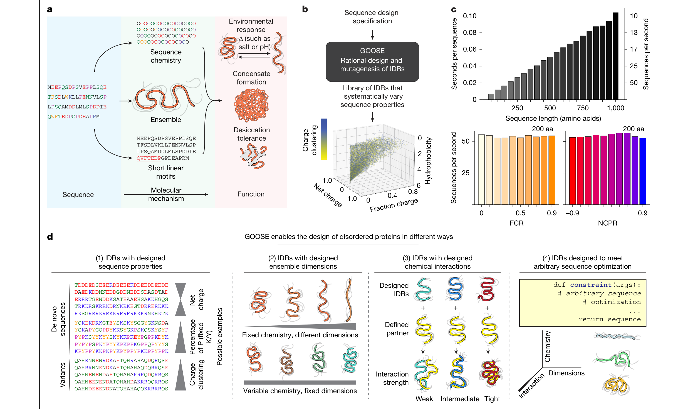
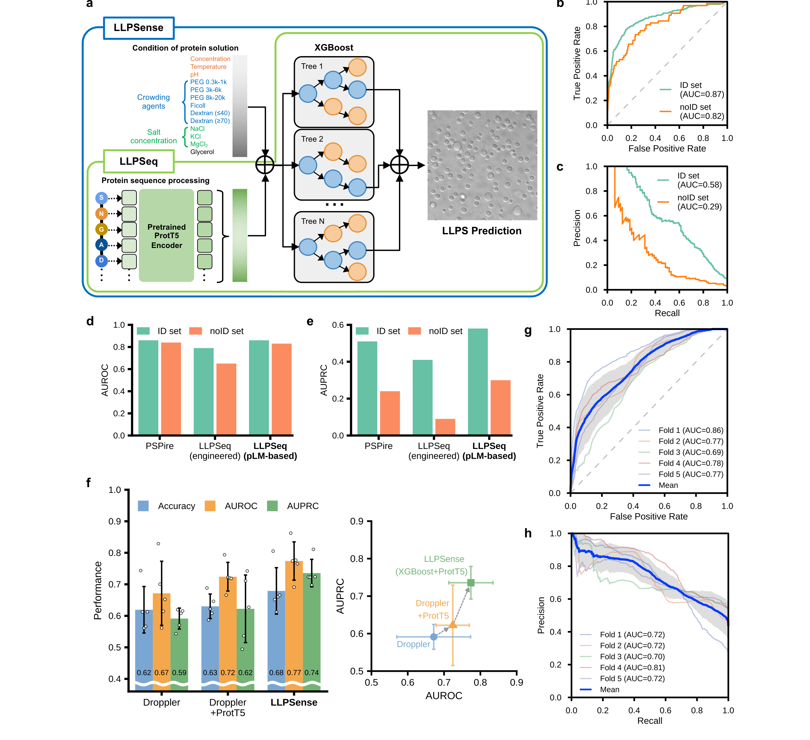
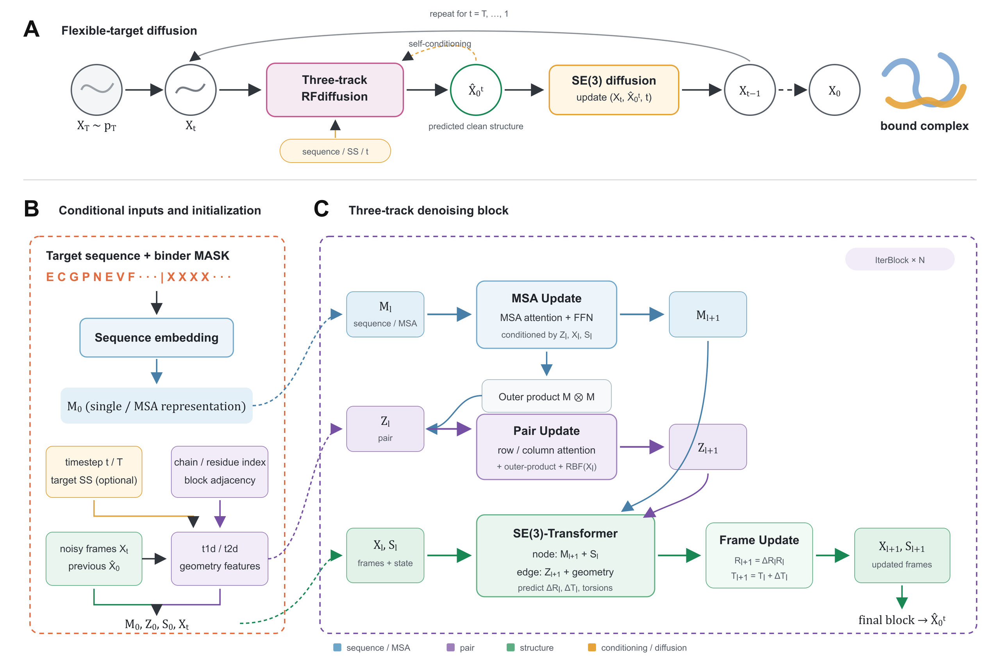

# source

- Source: `source.pptx`
- Total slides: 16

## Slide 1

IDP / IDR × ARTIFICIAL INTELLIGENCE

无序蛋白人工智能研究进展

序列、构象系综、功能与设计

三人小组文献调研与研究路线

以六篇代表性工作为节点，梳理 AI–IDP 的任务链、验证边界与可行研究方向

汇报人：A、B、C 时间：2026.__.__

H U A Z H O N G A G R I C U L T U R A L U N I V E R S I T Y

1

### Speaker Notes

这次汇报不是把六篇论文依次复述，而是围绕一条研究链回答三个问题：AI 能否可信地生成无序蛋白的构象系综；ensemble 是否真的能为功能预测提供额外信息；以及现有方法能否继续走向分子设计。前半部分先统一概念和评价标准，中间讲代表方法与 benchmark，最后给出可以纯计算起步的研究方向。整场预计四十分钟左右。

## Slide 2

概念准备：从 IDP / IDR 到统计 ensemble

IDP 与 IDR：说的是整条链，还是其中一段？

四个关键词：从一条结构到统计系综

- ① 构象 conformer
- 蛋白链在某一瞬间的一个三维结构。

- IDP｜内在无序蛋白
- 整条蛋白链在生理条件下不形成唯一、稳定的有序三维结构。
- 研究对象：整条链的构象分布

- ② 构象集合
- 多个可能构象的集合，尚未给出各自概率。

- ③ 统计 ensemble
- 构象集合 + 统计权重，描述“出现多少”的分布。

- IDR｜内在无序区
- 蛋白中某个区域不形成稳定结构，同一蛋白可同时含折叠结构域与 IDR。
- 研究对象：该区域在蛋白内部的构象分布

- ④ 构象状态
- 由统计 ensemble 描述的热力学状态。

术语依据：Towards a Unified Framework… Box 1；文献中常用 “IDPs” 统称两者，本汇报保持区分。

- 为什么还需要 forward model？
- 逐构象计算实验可观测量，再按统计权重求平均：〈O〉 = Σ w · O。所以“模型生成很多结构”并不自动等于得到可信的统计 ensemble。

2

### Speaker Notes

先区分 IDP 和 IDR。IDP 指整条蛋白在生理条件下缺少唯一稳定的有序结构；IDR 指蛋白内部的某一段无序区域，因此同一条蛋白可以同时包含折叠结构域和 IDR。二者共同点是不能只用一张固定结构图描述。这里的“无序”不是没有任何结构，而是构象快速互变、没有单一结构长期占据绝对主导。后文所说的序列到 ensemble，既可以针对完整 IDP，也可以针对某段 IDR。

## Slide 3

研究地图：AI–IDP 研究链条与三个判断问题

GOOSE

STARLING / IDPFold

LLPSense

binder / interface peptide

IDR 序列

序列性质

构象系综

相互作用 / LLPS

生物学功能

工程设计

- Q1 生成是否可信？
- 能否从一条序列生成覆盖合理、局部结构可信的 ensemble？
- 关注：分布覆盖、实验约束、非唯一性

- Q2 ensemble 是否真的有用？
- 在 sequence + environment 之外，ensemble 能否稳定提升功能预测？
- 关注：严格对照、跨环境泛化、消融

- Q3 能否走向设计？
- 能否设计 IDR 序列、binder 或凝聚体界面定位肽？
- 关注：设计目标、筛选终点、实验验证

本汇报的路线：先用统一评价框架判断“生成得对不对”，再检验 ensemble 的功能增益，最后进入设计任务。

3

### Speaker Notes

在概念统一后再看整个 AI–IDP 研究链。GOOSE 主要做性质约束下的序列生成；STARLING 和 IDPFold 做 sequence 到 ensemble；LLPSense 处理 sequence、environment 与 LLPS 行为；binder 和 interface peptide 工作进一步走向功能分子设计。这里并不是说六篇论文已经组成完整端到端系统，而是把它们放到同一张地图上，后文分别检查三个连接是否成立：生成是否可信、ensemble 是否增加功能信息、以及设计是否得到真实实验验证。

## Slide 4

评价框架：生成只是起点，必须形成验证闭环

- ① 实验观测
- SAXS：全局尺寸与形状
- PRE、smFRET：距离与接触
- NMR：局部构象倾向

- ② 计算生成与整合
- MD / 粗粒化 / 知识库
- 机器学习生成模型
- 最大熵或统计重加权

- ③ 验证与比较
- 物理与几何合理性
- 互补实验交叉验证
- 分布距离与功能相关性

闭环中的关键桥梁：forward model

候选构象与权重

预测实验可观测量

与真实观测比较

调整权重 / 模型

→

→

→

互补数据约束同一个 ensemble，避免只拟合一个平均量。

综述在本汇报中承担“评价框架”的角色：判断 STARLING、IDPFold 等输出是否真的可解释、可比较。

4

### Speaker Notes

Towards 综述提供的是一个评价闭环，而不是另一种单独生成模型。第一部分是实验观测，第二部分是计算生成和统计整合，第三部分是验证与比较。核心桥梁是 forward model：它把候选构象和权重转成 SAXS、PRE、smFRET 或 NMR 等可观测量，再与实验比较并调整模型或权重。由于单一平均量可能由不同 ensemble 产生，需要多种互补实验同时约束。这一框架用于检查 STARLING、IDPFold 等模型是否真正可解释和可比较。

## Slide 5

Benchmark：不是“再测一次”，而是统一条件下的盲测

- 定义｜固定靶标、环境条件、可观测量与评分规则，用未公开验证数据比较不同方法的真实泛化能力。
- 普通论文自测常使用不同数据、不同参考系综与不同指标，结果不能直接横向比较。

1

2

3

4

独立整理数据

提交 ensemble

统一自动评分

持续公开结果

- 多类 IDP / IDR
- 多种互补实验
- 明确实验条件

- 统一输入格式
- 禁止查看盲测标签
- 同时报告计算成本

- held-out 数据
- 全局 + 局部 + 分布
- 不确定性与残差

- 方法排名与指标剖面
- 失败案例可追踪
- 新数据循环更新

→

→

→

- IDP-Bench 要控制的变量
- 同一靶标与条件 ｜ 同一实验观测 ｜ 同一 forward model 或明确版本 ｜ 同一评分代码 ｜ 盲测集不参与训练
- 目标不是选出“万能冠军”，而是知道每种方法在哪类序列、尺度与观测上可靠或失效。

依据：Towards a Unified Framework… 提出的 IDP-Bench 四阶段双年周期与盲测原则。

5

### Speaker Notes

benchmark 不等于每篇论文再做一次自测。真正的 benchmark 要固定靶标、环境条件、可观测量、forward model 版本和评分规则，并用参与者看不到的验证数据测试泛化。Towards 提出的 IDP-Bench 包含四个阶段：独立委员会整理高质量数据；团队提交 ensemble；服务器在 held-out 数据上自动多指标评分；结果和失败案例持续公开。其目的不是选一个永远最好的模型，而是明确不同方法在什么序列、长度、环境和实验观测上可靠。

## Slide 6

怎么评价 ensemble：几何、实验、分布与稳健性

01 物理与几何有效性

02 全局 ensemble 一致性

03 局部与长程约束

键长、键角、扭转角、碰撞。先排除“不像蛋白”的样本，但通过这一层不等于分布正确。

SAXS χ²：散射曲线拟合；P(r) KL：整体距离分布差异；同时报告 Rg 与端到端距离分布。

PRE RMSE：瞬时长程接触；RDC Q-factor：局部取向；smFRET Wasserstein：距离分布。

04 分布而非只看均值

05 泛化与交叉验证

06 不确定性与效率

JS / Wasserstein / Hellinger 距离；图与接触概率的完整分布；检查覆盖不足与模式坍缩。

留出一种观测再预测它；新序列 / 新长度 / 新环境；避免只复现训练或重加权数据。

实验误差 + forward model 误差；bootstrap / 置信区间 / 残差；采样成本与有效独立样本数。

评分原则：综合分数便于排序，但必须公开各指标剖面；单一 Rg、距离图或实验拟合都不足以证明 ensemble 正确。

6

### Speaker Notes

统一流程之后还要解决如何打分。第一层先检查键长、扭转角和碰撞，排除不合理结构；第二层看 SAXS、P(r)、Rg 等全局分布；第三层看 PRE、RDC、smFRET 等局部和长程约束；第四层直接比较完整分布，识别覆盖不足或模式坍缩；第五层做留出观测、新序列和新环境泛化；第六层报告实验误差、forward-model 误差、置信区间和计算成本。综合分数可以排序，但必须保留各指标剖面，否则会掩盖模型只在某一维度表现好的问题。

## Slide 7

GOOSE：可控 IDR 序列设计

- 核心问题
- 怎样根据预设的序列或聚合物性质，反向生成 IDR 序列？

- 输入与输出
- 输入：长度、电荷、疏水性、κ 等目标性质。
- 输出：满足约束的 IDR 序列。

- 关键证据
- 性质命中率、序列多样性，以及与天然 IDR 的比较。

- 汇报边界
- GOOSE 主要设计序列，不直接输出具有统计权重的三维 ensemble。

Figure 1｜GOOSE 的序列设计流程与性质控制结果（源自原文）

7

### Speaker Notes

GOOSE 的输入是长度、电荷、疏水性或构象倾向等性质约束，输出是满足这些约束且保持多样性的 IDR 序列。它的重要性在于把“预测一个序列的性质”反过来变成“按性质设计序列”。但它不直接输出三维 ensemble，也不能保证序列在细胞中具有目标功能。因此在研究链中，GOOSE 是 sequence design 的入口，可与 STARLING 或 IDPFold 连接形成候选序列—构象评价闭环，但这仍需要单独验证。

## Slide 8

STARLING：快速构象系综生成

- 核心问题
- 能否从序列和条件，快速生成大量相互一致的 IDR 构象？

- 输入与输出
- 输入：IDR 序列及论文支持的环境条件。
- 输出：残基距离表示与三维构象集合。

- 关键证据
- 采样速度、全局尺寸分布，以及与参考 ensemble 的一致性。

- 汇报边界
- 样本仍受训练 ensemble 与力场质量的限制。

Figure 1｜STARLING 模型结构与生成结果（源自原文）

8

### Speaker Notes

STARLING 的目标是从氨基酸序列和条件快速生成大量构象。模型内部使用残基—残基距离表示，再恢复成三维构象；多个独立样本共同描述分布。汇报这篇时重点不是展开每一层网络，而是看三类证据：采样速度与规模、Rg 或端到端距离等全局分布、以及距离图或参考 ensemble 的一致性。它的优势是快速，但评价仍依赖模拟或参考数据，生成大量样本也不自动证明统计权重和真实实验一致。

## Slide 9

IDPFold：残基刚体扩散生成 ensemble

- 输入、输出与证据
- 输入：氨基酸序列。
- 输出：多次采样的主链构象与扭转角。
- 证据：同时检查全局尺寸与局部结构。

- 汇报边界
- 样本不提供状态转换速率，也不能自动解释为真实平衡权重。

- 与 STARLING 的区别
- STARLING 强调快速采样与距离表示；IDPFold 强调残基刚体、主链几何与扩散生成。

- 共同局限
- 都依赖参考 ensemble / 模拟分布，“生成得像”不等于“真实权重与动力学正确”。

Figure 1｜IDPFold 的扩散去噪框架与主链输出（源自原文）

9

### Speaker Notes

IDPFold 同样从序列生成多个构象，但表示方式更接近主链几何：每个残基用刚体框架和扭转角描述，扩散过程从随机框架逐步去噪，重复采样得到构象集合。与 STARLING 的差别压缩在本页右下角：一个更强调距离表示与速度，一个更强调刚体、主链几何和扩散生成。共同边界是，论文主要验证生成样本和统计分布，没有证明采样顺序等于真实转换路径，也没有给出真实动力学时间尺度。

## Slide 10

LLPSense：环境信息有用，但 ensemble 机制尚未证明

- 论文能够支持的判断
- 输入：序列特征 + 原文定义的环境变量。
- 输出：分类、分数或相边界。
- 重点：环境条件是否改善独立测试表现。
- 意义：功能行为不能只看序列本身。

- 论文尚不能支持的判断
- 没有显式使用 ensemble，就不能说明“构象分布 → 多价相互作用 → LLPS”这一机制成立。

- 真正的断点
- ensemble 是否比 sequence + environment 提供额外信息？

Figure 1｜LLPSense 的数据流与预测表现（源自原文）

10

### Speaker Notes

LLPSense 说明 sequence 加 environment 对相分离相关预测有价值，例如把盐浓度、温度或其他环境条件纳入输入后，模型能够描述条件依赖的变化。但这篇工作没有显式输入或生成构象 ensemble，因此不能据此断言“ensemble 通过多价相互作用决定 LLPS”的机制已被证明。它真正留下的计算问题是：在同样的序列和环境信息上，再加入 ensemble 特征，能否获得稳定、可迁移且可解释的增益。

## Slide 11

如何验证 ensemble 是否提供额外信息

一、固定数据与划分，只改变模型输入

二、避免“看起来提升”的四项检查

- 数据划分
- 按蛋白而不是按样本随机划分

- M1 仅序列 sequence → LLPS
- 回答：序列本身能做到什么程度？

- 跨环境
- 训练条件之外测试泛化

- M2 序列 + 环境 sequence + condition → LLPS
- 回答：盐、温度、浓度等条件是否带来增益？

- 消融实验
- 去掉 Rg、接触或局部结构特征

- 跨生成器
- 更换 STARLING / IDPFold / CALVADOS

- M3 序列 + 环境 + ensemble 加入构象统计特征
- 回答：在公平对照下，ensemble 是否仍提供额外信息？

- 评价
- 预测性能、校准、跨条件稳定性

- 判定标准
- 支持：M3 在蛋白级划分、跨环境和跨生成器测试中仍稳定优于 M2。
- 不支持：提升只来自数据泄漏、某个生成器偏差，或加入序列长度等简单特征后消失。

11

### Speaker Notes

这一页把上面的缺口转成可执行实验。M1 只输入序列，M2 输入序列和环境，M3 再加入由同一生成器得到的 ensemble 统计特征。三组必须使用相同数据、蛋白级划分和尽量接近的模型容量。除了普通测试，还要做跨环境测试、ensemble 特征消融以及跨生成器验证。只有 M3 在这些条件下仍稳定优于 M2，且提升不是由长度或数据泄漏造成，才能支持 ensemble 提供了额外功能信息。这是目前最适合纯计算切入的方向。

## Slide 12

柔性 IDR 靶标的 binder 设计：方法、证据与边界

- 核心思路
- 联合生成 target 结合构象与 binder 主链。

- 创新点 1｜Sequence-input RFdiffusion
- 不提供 target 三维坐标，仅输入靶序列；
target 与 binder 在扩散过程中共同成形。

创新点 2｜二级结构条件

可指定 helix、β-strand 或 loop，
但不固定 target 的精确三维坐标。

创新点 3｜Two-sided partial diffusion

对 target 与 binder 同时部分加噪，
在初始命中附近共同优化结合界面。

12

### Speaker Notes

- 这项工作针对柔性 IDR 靶片段设计 binder。
本文没有提出新的扩散理论，而是将RFdiffusion的蛋白质刚体扩散框架扩展到坐标未知的柔性IDR靶标，使靶标结合态构象与binder骨架能够联合生成。
图A展示的是扩散模型生成蛋白质骨架的基本过程。
- 最左侧表示生成起点：模型从先验分布中随机采样一个高噪声结构。这里随机的是各个残基在三维空间中的位置和朝向，并不是给氨基酸序列加噪。
- 进入第 t 步后，RFdiffusion接收当前带噪结构、时间步以及靶标条件，预测这个结构完全去噪后可能呈现的最终形态。这个预测结果只是模型在当前时刻对最终结构的估计，还不能直接作为输出。
- 随后，扩散更新过程综合当前带噪结构和预测的干净结构，只去除一部分噪声，得到下一步结构。新的结构再次输入网络，继续进行预测和更新。
- 随着这个过程反复进行，残基的位置和朝向逐渐从随机状态变得有序，最终形成IDR的结合态构象以及与它相互匹配的binder主链结构。
- 因此，图A的核心不是“一步预测蛋白质结构”，而是“每一步预测最终结构，再逐步向它靠近”，直到完成整个去噪过程。
流程是先给出目标氨基酸片段，并可指定候选结合态的二级结构倾向；RFdiffusion 生成与该靶片段兼容的 binder 主链和复合物构象；ProteinMPNN 根据主链设计 binder 序列；AlphaFold 用于筛选单体是否稳定、复合物是否保持预期界面；最后由实验测定亲和力、特异性和稳定性。它解决的是结合态共同设计，不是在恢复 IDR 的完整自由态 ensemble。

## Slide 13

凝聚体界面的 de novo 肽设计

- 核心问题
- 怎样设计能够优先定位在生物分子凝聚体界面的短肽？

- 输入与输出
- 输入：按原文填写的凝聚体与设计条件。
- 输出：具有界面定位偏好的新肽序列。

- 关键证据
- 用显微图与定量富集指标证明肽位于界面，而不是只进入凝聚体内部。

- 汇报边界
- 面向凝聚体介观环境，不等同于针对单个 IDR 靶点设计 binder。

Figure 1｜界面定位肽的设计流程与富集验证（源自原文）

13

### Speaker Notes

interface peptide 的目标层级与 binder 不同。它不是识别某条 IDR 的特定位点，而是设计能够定位并富集于凝聚体介观界面的短肽。输入包含凝聚体组分、界面环境和候选序列，输出是界面定位肽，关键证据来自显微定位和定量富集。它与 binder 都属于功能分子设计，但无需做冗长优劣对比：前者面向凝聚体空间界面，后者面向特定靶片段的分子识别，验证终点不同。

## Slide 14

从六篇论文得到的证据、缺口与可做任务

研究环节

代表工作

已经证明

仍未证明

可做任务

性质 → 序列

GOOSE

可按长度、电荷、疏水性等性质生成多样 IDR 序列

目标性质是否转化为真实功能

加入 ensemble 或功能奖励

序列 → ensemble

STARLING / IDPFold

可快速生成大量构象，覆盖全局与局部统计

真实平衡权重、动力学及跨条件迁移

统一数据与实验约束下的模型评测

环境 → LLPS

LLPSense

环境信息有助于预测相分离相关行为

ensemble 是否提供额外且可迁移的信息

M1 / M2 / M3 严格对照与跨环境测试

IDR → binder

Diffusing protein binders

可生成稳定 binder 并识别兼容结合构象

是否覆盖多状态与动态靶向需求

多构象条件设计与鲁棒性筛选

凝聚体 → 定位肽

interface peptide design

可设计界面富集的短肽分子

跨凝聚体泛化与机制可解释性

环境依赖的功能设计与多目标设计

综合判断：论文已解决局部任务，但 “ensemble → function” 的可迁移连接仍是最清楚的研究缺口。

14

### Speaker Notes

这一页不是重复研究链，而是把六篇工作升级为证据矩阵。每一行同时回答代表论文证明了什么、没有证明什么、我们能做什么。综合判断是：性质约束序列设计、快速 ensemble 生成、环境相关 LLPS 预测和功能分子设计都已有局部成果；最明显的断点仍是不同生成器是否在统一 benchmark 上可信，以及 ensemble 是否能为功能预测带来可迁移增益。后续选题应直接围绕这些未闭合连接，而不是重复造一个网络。

## Slide 15

三个可落地的计算研究方向

低风险 / 先建立基线

中风险 / 最推荐切入

高风险 / 后续拓展

方向一 统一评测

方向二 ensemble 增强 LLPS

方向三 ensemble-aware 设计

· 数据：相同序列、条件与观测

· 数据：序列、环境、LLPS 标签 / 读数

· 对象：IDR 序列、binder 或定位肽

· 奖励：ensemble、LLPS、聚集风险与序列多样性

· 基线：STARLING / IDPFold / CALVADOS

· 基线：M1 序列；M2 序列 + 环境

· 指标：Rg、接触、局部结构、覆盖

· 方法：M3 加入 ensemble 统计特征

· 基线：单状态或单目标设计

· 产出：benchmark、误差分析、工具

· 指标：性能、校准、跨环境泛化

· 指标：鲁棒性、特异性、跨状态表现

· 风险：验证成本最高，需外部合作

· 风险：创新性取决于数据与评价设计

· 风险：必须控制数据泄漏与生成器偏差

建议顺序：统一评测建立可信基线 → 验证 ensemble 的功能增益 → 再进入多目标设计。

15

### Speaker Notes

三个方向按风险递增。方向一是统一评测：复现 STARLING、IDPFold 和基线模拟，建立相同靶标、条件、forward model 和多指标报告，最容易形成可信基线。方向二是 ensemble 增强的 LLPS 预测：完成 M1/M2/M3 严格对照，科学问题清楚，也可纯计算完成，最推荐作为当前切入点。方向三是 ensemble-aware 设计，把构象覆盖、相分离或脱靶风险加入设计目标，潜力最大，但验证成本和生物合作要求最高。建议先一或二，再推进三。

## Slide 16

结论与讨论

三条结论

建议与下一步

- 1. 概念层面
- IDP / IDR 的“无序”指没有单一主导结构；描述它们必须用带统计权重的 ensemble，而不是一条结构。

· 最值得投入的切入点是“ensemble 是否提供额外信息”的严格对照实验（M1 / M2 / M3）。

· 优先统一数据与评价口径：按蛋白划分、跨环境测试、跨生成器消融。

- 2. 方法层面
- GOOSE、STARLING、IDPFold 已能生成序列与构象；但“生成得像”不等于权重与动力学正确。

· 设计类任务（binder、界面肽）验证成本最高，建议先建立评测基线再进入。

- 3. 评价层面
- 只有在统一靶标、条件与观测下的盲测，配合分布级指标，才能比较不同方法。

· 需要外部实验合作，才能把“分布正确”从计算结论推进到可检验结论。

谢谢！

欢迎老师与同学批评指正。

### Speaker Notes

最后讨论三个选择：第一，先做统一 benchmark，建立数据和评价能力；第二，先验证 ensemble 对 LLPS 或相互作用预测是否提供额外信息；第三，直接进入 binder 或凝聚体界面肽设计。我的建议是以方向一作为基础设施、方向二作为主研究问题，并把方向三保留为中长期延伸。若老师追问现有论文证据边界，可返回第十七页；若讨论具体课题工作量和产出，返回第十八页。
