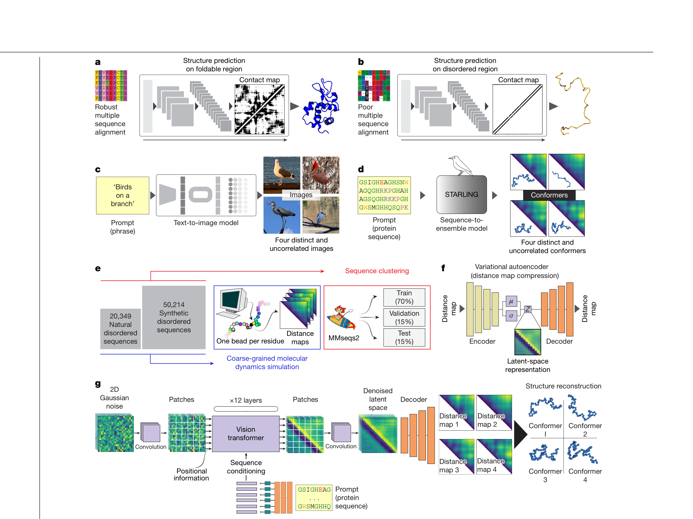
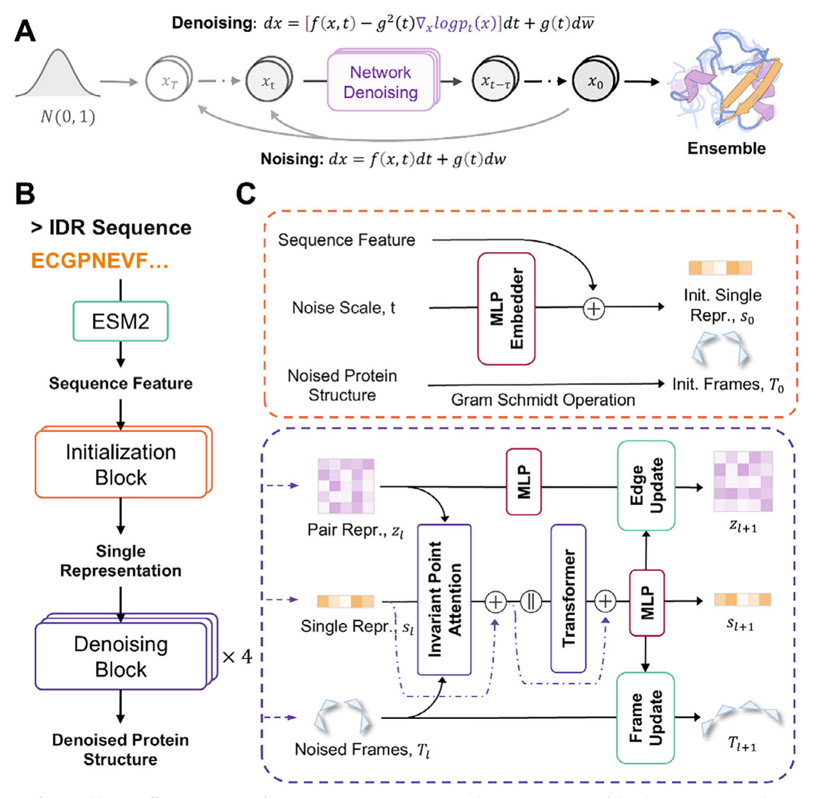
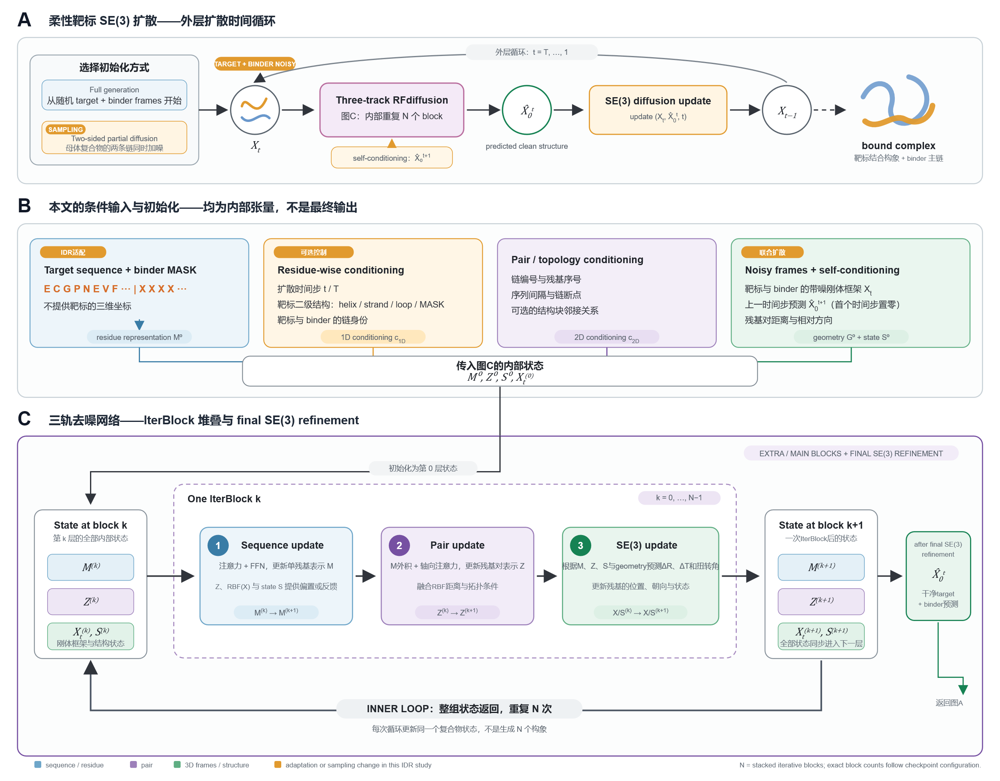
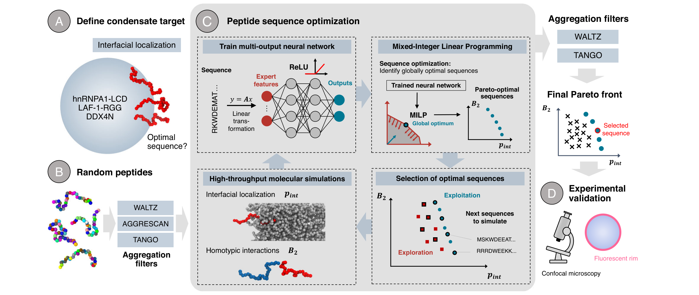

# source

- Source: `source.pptx`
- Total slides: 15

## Slide 1

IDP / IDR × ARTIFICIAL INTELLIGENCE

无序蛋白人工智能研究进展

序列、构象系综、功能与设计

三人小组文献调研与研究路线

以六篇代表性工作为节点，梳理 AI–IDP 的任务链、验证边界与可行研究方向

汇报人：A、B、C 时间：2026.__.__

H U A Z H O N G A G R I C U L T U R A L U N I V E R S I T Y

1

### Speaker Notes

这次汇报不是把六篇论文依次复述，而是围绕一条研究链回答三个问题：AI 能否可信地生成无序蛋白的构象系综；ensemble 是否真的能为功能预测提供额外信息；以及现有方法能否继续走向分子设计。前半部分先统一概念和评价标准，中间讲代表方法与 benchmark，最后给出可以纯计算起步的研究方向。整场预计四十分钟左右。

## Slide 2

概念准备：从 IDP / IDR 到统计 ensemble

IDP 与 IDR的区别：

四个专业术语：

- ① 构象 conformer
- 蛋白链在某一瞬间的一个三维结构。

- IDP｜内在无序蛋白
- 整条蛋白链在生理条件下不形成唯一、稳定的有序三维结构。
- 研究对象：整条链的构象分布

- ② 构象集合
- 多个可能构象的集合，尚未给出各自概率。

- ③ 统计 ensemble
- 构象集合 + 统计权重，描述“出现多少”的分布。

- IDR｜内在无序区
- 蛋白中某个区域不形成稳定结构，同一蛋白可同时含折叠结构域与 IDR。
- 研究对象：该区域在蛋白内部的构象分布

- ④ 构象状态
- 由统计 ensemble 描述的热力学状态。

- 为什么还需要 forward model？
- 逐构象计算实验可观测量，再按统计权重求平均。所以“模型生成很多结构”并不自动等于得到可信的统计 ensemble。

2

### Speaker Notes

先区分 IDP 和 IDR。IDP 指整条蛋白在生理条件下缺少唯一稳定的有序结构；IDR 指蛋白内部的某一段无序区域，因此同一条蛋白可以同时包含折叠结构域和 IDR。二者共同点是不能只用一张固定结构图描述。这里的“无序”不是没有任何结构，而是构象快速互变、没有单一结构长期占据绝对主导。后文所说的序列到 ensemble，既可以针对完整 IDP，也可以针对某段 IDR。

## Slide 3

AI–IDP 研究路径以及一些标准化问题

STARLING / IDPFold

LLPSense

binder

GOOSE

评判标准

IDR序列

构象系综

相互作用 / LLPS

生物学功能

工程设计

- Q1 生成是否可信？
- 能否从一条序列生成覆盖合理、局部结构可信的 ensemble？

- Q2 ensemble 是否真的有用？
- 在 sequence + environment 之外，加入ensemble 能否稳定提升功能预测？

- Q3 能否走向设计？
- 能否设计 IDR 序列、binder 或凝聚体界面定位肽？

本汇报的路线：先用统一评价框架判断“生成得对不对”，再检验 ensemble 的功能增益，最后进入设计任务。

3

### Speaker Notes

- GOOSE 主要做性质约束下的序列生成；STARLING 和 IDPFold 做 sequence 到 ensemble；LLPSense 处理 sequence、environment 与 LLPS 行为；binder 和 interface peptide 工作进一步走向功能分子设计。这里不是说六篇论文已经组成完整系统，而是把它们放到一条序列上讲一下。
- 第一个问题是“生成是否可信”。模型能够生成很多外观合理的蛋白结构，并不代表这些结构会在真实条件下以明显概率存在。我们需要分别检查单个构象的几何合理性、整个ensemble的分布和权重，以及它能否解释独立实验数据。因此，这一步解决的是模型是否近似了真实的构象概率分布，而不只是生成了几张合理的结构图。
- 第二个问题是“ensemble是否真的有用”。ensemble本身由sequence和environment决定，因此加入ensemble特征后预测性能提高，也可能只是重复利用了序列长度、电荷或疏水性等已有信息。需要比较sequence、sequence加environment，以及进一步加入ensemble的三组模型。只有加入ensemble后，在功能预测等等测试中仍带来稳定增益，才能说明它包含额外的功能信息。
- 第三个问题是“能否走向设计”。如果前两步已经建立了sequence、ensemble和function之间的可靠关系，就可以反过来设计满足目标的IDR序列、binder或凝聚体定位肽。但设计不能只优化一个预测分数，还要考虑多个构象、不同环境、脱靶结合和聚集风险。纯计算研究可以完成候选生成和筛选，但在没有实验验证时，结论应限定为in design candidates。

## Slide 4

评判标准

核心问题｜不重做湿实验，怎样判断模型生成的 ensemble 是否可信？

序列 + 条件

→

生成 ensemble

→

forward model

→

预测实验观测

→

held-out 公开数据

→

误差与置信区间

公开数据来源｜SAXS / NMR / PRE / FRET / Rg

证据等级

能说明什么

不能说明什么

几何检查

构象在结构上基本合理

不能证明分布正确

参考模拟

不能证明符合真实体系

与某种力场或生成器一致

公开实验数据

对真实观测具有解释能力

仍不能唯一确定 ensemble

本页结论｜结论只能写成“与公开独立数据一致”，不能凭结构图或参考模拟宣称 ensemble 真实准确。

4

### Speaker Notes

- 我们不需要亲自做实验，也可以进行外部验证——已有论文和数据库提供了 SAXS、NMR、PRE 和 FRET 数据。这四个数据主要是去评判生成的构象的化学特性，SAXS：整条链的大小和整体形状全局尺寸、紧凑程度NMR chemical shift每个残基附近的化学环境局部二级结构倾向PRE相距较远残基是否曾经短暂靠近瞬时长程接触FRET两个标记位点之间的距离特定位点距离分布
- 模型生成 ensemble 后，通过统一的 forward model 计算这些实验理论上会观测到什么，再与公开数据比较。
- 实验仪器测到的通常不是三维构象本身，而是一条曲线、一个效率值或一组残基级数值。因此，必须把模型生成的三维构象“翻译”成实验能够测到的信号。
- 这个“从结构计算实验信号”的程序，就是forward model。
- “held-out公开数据”不是一种特殊实验，而是指：
- 数据已经公开，但在模型训练、调参、筛选和重加权过程中完全没有使用，只在模型确定以后用于最终考试。
- 需要特别注意三点。第一，几何合理性、参考模拟一致性和实验一致性代表三个不同的证据等级：几何检查只能排除“不像蛋白”的结构，参考模拟只能说明与某种力场或生成器一致，只有 held-out 实验数据才能提供外部验证。第二，开发集可以用于选择参数和 forward model，测试集只能用于最终评分，不能根据测试结果反复调整 ensemble 权重，否则得到的只是拟合效果，而不是泛化能力。第三，不同 ensemble 可能产生相似的实验观测，单一实验不能唯一确定 ensemble，应尽量使用多种互补观测。
- 因此本页结论只能限定为“与公开独立数据一致”，不能只根据结构图或参考模拟宣称 ensemble 真实准确。

## Slide 5

评判标准

评价层次

代表指标

回答的问题

结论边界

几何有效性

主链连续性、键长 / 键角 / 扭转角、原子碰撞、链断裂

构象是否基本合理

不能证明分布正确

分布覆盖

Rg、Ree、残基接触概率、残基对距离、二级结构倾向；JS / Wasserstein 比较完整分布

是否覆盖多个状态，有无 mode collapse

相似只说明学到了参考分布

实验一致性

SAXS χ²、PRE RMSE、NMR 局部倾向、FRET 距离分布

能否解释独立获得的真实观测

不同 ensemble 可给出相似观测

稳健性与效率

种子一致性、采样收敛、长度 / 组成敏感性、每千构象耗时与显存

是否可重复、可扩展

不代表生物准确性

综合判定口径｜证据等级决定结论强度

- 仅通过几何检查
- 只能说：构象几何合理

- 能复现参考模拟
- 只能说：近似某力场 / 训练分布

- 能预测 held-out 实验
- 才可说：与独立观测一致

- 跨序列、跨条件稳定
- 才可说：具备泛化能力

本页结论｜评价结论必须与证据等级匹配，不能从“结构合理”直接推导出“ensemble 真实”。

6

### Speaker Notes

- 评价分四层。第一层只排除明显错误的结构，比如主链断裂、原子碰撞或不合理的键长键角；第二层判断模型是否覆盖了合理的构象分布，是否只生成少数相似构象、出现 mode collapse，可以用 JS divergence 或 Wasserstein distance 比较完整分布；第三层利用公开实验数据做外部验证，用同一个 forward model 计算 SAXS χ²、PRE RMSE、NMR 局部倾向和 FRET 距离分布，在 held-out 数据上报告误差；第四层检查随机种子稳定性、采样收敛、对序列长度与组成的敏感性，以及每千个构象的运行时间和显存占用。
- 每一层支持的结论不同，这是这一页最关键的区分。只能通过几何检查，结论就写成“模型可以生成几何上合理的构象”；能复现参考模拟，就写“模型能够近似某一参考力场或训练 ensemble”；能预测 held-out 实验数据，才可以进一步说“模型生成的 ensemble 与独立实验观测一致”；只有在跨序列、跨条件下仍然稳定，才可以支持“模型具有一定泛化能力，可用于未知 IDR 分析”。
- 最常见的错误是看到合理的 Rg 或几个漂亮的构象，就宣称模型恢复了真实 ensemble。更可靠的说法应该明确模型究竟通过了哪一级证据。另外要注意，不同 ensemble 可能产生相似的实验观测，单一实验不能唯一确定 ensemble，应尽量使用多种互补观测。

## Slide 6

GOOSE：可控 IDR 序列设计

- 核心问题
- 怎样根据预设的序列或聚合物性质，反向生成 IDR 序列？

- 输入与输出
- 输入：长度、电荷、疏水性、κ 等目标性质。
- 输出：满足约束的 IDR 序列。

- 关键证据
- 性质命中率、序列多样性，以及与天然 IDR 的比较。

- 汇报边界
- GOOSE 主要设计序列，不直接输出具有统计权重的三维 ensemble。

Figure 1｜GOOSE 的序列设计流程与性质控制结果（源自原文）

7

### Speaker Notes

GOOSE 的输入是长度、电荷、疏水性或构象倾向等性质约束，输出是满足这些约束且保持多样性的 IDR 序列。它的重要性在于把“预测一个序列的性质”反过来变成“按性质设计序列”。但它不直接输出三维 ensemble，也不能保证序列在细胞中具有目标功能。因此在研究链中，GOOSE 是 sequence design 的入口，可与 STARLING 或 IDPFold 连接形成候选序列—构象评价闭环，但这仍需要单独验证。

## Slide 7

STARLING：快速构象系综生成

- 核心问题
- 能否从序列和条件，快速生成大量相互一致的 IDR 构象？

- 输入与输出
- 输入：IDR 序列及论文支持的环境条件。
- 输出：残基距离表示与三维构象集合。

- 关键证据
- 采样速度、全局尺寸分布，以及与参考 ensemble 的一致性。

- 汇报边界
- 样本仍受训练 ensemble 与力场质量的限制。

Figure 1｜STARLING 模型结构与生成结果（源自原文）

8

### Speaker Notes

STARLING 的目标是从氨基酸序列和条件快速生成大量构象。模型内部使用残基—残基距离表示，再恢复成三维构象；多个独立样本共同描述分布。汇报这篇时重点不是展开每一层网络，而是看三类证据：采样速度与规模、Rg 或端到端距离等全局分布、以及距离图或参考 ensemble 的一致性。它的优势是快速，但评价仍依赖模拟或参考数据，生成大量样本也不自动证明统计权重和真实实验一致。

## Slide 8

IDPFold：残基刚体扩散生成 ensemble

- 主要创新点：
- 以往很多方法只能预测 回转半径、端到端距离等统计性质，或者生成较粗粒度的构象。IDPFold直接从单条氨基酸序列出发，生成残基主链级三维构象

- 与 STARLING 的区别
- IDPFold和STARLING都属于“sequence → ensemble”生成模型，但二者解决问题的侧重点不同：
- IDPFold强调主链级三维结构与局部几何；STARLING强调粗粒化ensemble的速度、分布覆盖和大规模应用。

- 共同局限
- 1）生成的都是模拟的ensemble不是真实的
- 2）生成的是平衡构象样本，不是动态轨迹
- 3）都不是完整的全原子模型
- 4）环境条件描述仍然有限

9

### Speaker Notes

- 前面介绍了IDP不是一个固定结构，而是在不同构象之间不断变化。因此，IDPFold的目标不是预测一个最可能结构，而是从同一条IDR序列中重复生成多个构象，用这些构象近似其构象ensemble。模型的输入主要是一条氨基酸序列。首先，ESM2把序列编码成每个残基的序列特征；随后，扩散模型从一组随机的残基刚体框架开始，逐步去除位置和方向上的噪声，最终生成一个完整构象。在每一步去噪过程中，模型同时维护三类信息：第一类是single representation，表示每个残基自身的特征；第二类是pair representation，描述残基对之间的关系；第三类是刚体框架 Tl，描述每个残基当前的位置和方向。IPA利用残基的特征、残基对关系和三维坐标，使序列信息与空间几何信息发生交互；随后网络更新single、pair和刚体框架，重复多个denoising block，逐渐得到无噪结构。
这里最关键的一点是：一次扩散采样只生成一个构象。对同一条序列使用不同随机初始噪声，重复采样很多次，才得到一个ensemble。也就是说，ensemble不是一次性输入或一次性输出的，而是由多次独立生成的构象共同组成。论文结果表明，IDPFold生成的ensemble在回转半径、端到端距离、局部二级结构以及部分实验观测上能够接近参考数据。这说明刚体扩散可以用于IDP构象采样，而不仅是固定结构预测。
- 但需要注意，IDPFold学习到的是训练数据中构象分布的近似。单个生成构象几何合理，并不代表它一定在真实ensemble中具有较高概率；与模拟参考一致，也不能完全等同于与真实实验一致。因此，我们更关心的不是模型能否生成漂亮的结构，而是整个构象分布能否覆盖合理状态，并解释独立实验观测。”
- 这两个模型虽然在生成方式和结构分辨率上存在差异，但也面临四个共同局限。
- 第一，模型生成的ensemble本质上是对模拟数据分布的学习和近似，并不能直接等同于真实的生物构象ensemble。IDPFold主要从IDP模拟轨迹中学习，STARLING主要学习Mpipi-GG粗粒化模拟。因此，模型不仅会学习其中的物理规律，也可能继承模拟力场的偏差。模型与参考模拟结果一致，只能说明它较好地复现了教师模型，还需要通过独立实验数据进一步验证。
- 第二，它们生成的是平衡构象样本，而不是连续的动态轨迹。不同构象之间没有明确的时间顺序，所以我们可以利用这些样本分析回转半径、残基距离以及不同构象状态的分布，但不能直接判断一个构象如何转变为另一个构象，也不能得到转换速率、状态寿命或者具体的结合路径。也就是说，它们描述的是“体系可能处于哪些状态”，而不是“体系如何随时间运动”。
- 第三，两种方法都不是完整的全原子模型。STARLING采用每个残基一个珠子的粗粒化表示，IDPFold虽然分辨率更高，但主要生成主链骨架，仍然没有完整描述所有侧链原子、溶剂和离子。因此，它们适合研究整体尺寸、距离分布和主链结构倾向，但如果要分析精确氢键、侧链堆积、盐桥或配体结合，还需要进一步进行原子补全和结构优化。
- 第四，环境条件的描述仍然有限。真实IDP的ensemble会受到温度、pH、离子强度、翻译后修饰、分子拥挤以及结合伙伴等因素影响。STARLING能够输入有限范围的离子强度，而IDPFold主要以氨基酸序列作为条件，但两者都没有完整覆盖真实细胞环境。
- 并且这个只是生成的集合构象不能严格算ensemble，因为只有一对构象没有足够的概率，但是某种构象比另一种构象多又会隐含概率，所以算做了ensemble

## Slide 9

LLPSense：环境信息有用，但 ensemble 机制尚未证明

- 论文能够支持的判断
- 输入：序列特征 + 原文定义的环境变量。
- 输出：分类、分数或相边界。
- 重点：环境条件是否改善独立测试表现。
- 意义：功能行为不能只看序列本身。

- 论文尚不能支持的判断
- 没有显式使用 ensemble，就不能说明“构象分布 → 多价相互作用 → LLPS”这一机制成立。

- 真正的断点
- ensemble 是否比 sequence + environment 提供额外信息？

Figure 1｜LLPSense 的数据流与预测表现（源自原文）

10

### Speaker Notes

LLPSense 说明 sequence 加 environment 对相分离相关预测有价值，例如把盐浓度、温度或其他环境条件纳入输入后，模型能够描述条件依赖的变化。但这篇工作没有显式输入或生成构象 ensemble，因此不能据此断言“ensemble 通过多价相互作用决定 LLPS”的机制已被证明。它真正留下的计算问题是：在同样的序列和环境信息上，再加入 ensemble 特征，能否获得稳定、可迁移且可解释的增益。

## Slide 10

柔性 IDR 靶标的 binder 设计：方法、证据与边界

- 核心思路
- 联合生成 target 结合构象与 binder 主链。

- 创新点 1｜Sequence-input RFdiffusion
- 不提供 target 三维坐标，仅输入靶序列；
target 与 binder 在扩散过程中共同成形。

创新点 2｜二级结构条件

可指定 helix、β-strand 或 loop，
但不固定 target 的精确三维坐标。

创新点 3｜Two-sided partial diffusion

对 target 与 binder 同时部分加噪，
在初始命中附近共同优化结合界面。

12

### Speaker Notes

- 这项工作针对柔性 IDR 靶片段设计 binder。
本文没有提出新的扩散理论，而是将RFdiffusion的蛋白质刚体扩散框架扩展到坐标未知的柔性IDR靶标，使靶标结合态构象与binder骨架能够联合生成。
图A展示的是扩散模型生成蛋白质骨架的基本过程。
- 最左侧表示生成起点：模型从先验分布中随机采样一个高噪声结构。这里随机的是各个残基在三维空间中的位置和朝向，并不是给氨基酸序列加噪。
- 进入第 t 步后，RFdiffusion接收当前带噪结构、时间步以及靶标条件，预测这个结构完全去噪后可能呈现的最终形态。这个预测结果只是模型在当前时刻对最终结构的估计，还不能直接作为输出。
- 随后，扩散更新过程综合当前带噪结构和预测的干净结构，只去除一部分噪声，得到下一步结构。新的结构再次输入网络，继续进行预测和更新。
- 随着这个过程反复进行，残基的位置和朝向逐渐从随机状态变得有序，最终形成IDR的结合态构象以及与它相互匹配的binder主链结构。
- 因此，图A的核心不是“一步预测蛋白质结构”，而是“每一步预测最终结构，再逐步向它靠近”，直到完成整个去噪过程。
流程是先给出目标氨基酸片段，并可指定候选结合态的二级结构倾向；RFdiffusion 生成与该靶片段兼容的 binder 主链和复合物构象；ProteinMPNN 根据主链设计 binder 序列；AlphaFold 用于筛选单体是否稳定、复合物是否保持预期界面；最后由实验测定亲和力、特异性和稳定性。它解决的是结合态共同设计，不是在恢复 IDR 的完整自由态 ensemble。

## Slide 11

凝聚体界面的 de novo 肽设计

- 核心问题
- 怎样设计能够优先定位在生物分子凝聚体界面的短肽？

- 输入与输出
- 输入：按原文填写的凝聚体与设计条件。
- 输出：具有界面定位偏好的新肽序列。

- 关键证据
- 用显微图与定量富集指标证明肽位于界面，而不是只进入凝聚体内部。

- 汇报边界
- 面向凝聚体介观环境，不等同于针对单个 IDR 靶点设计 binder。

Figure 1｜界面定位肽的设计流程与富集验证（源自原文）

13

### Speaker Notes

interface peptide 的目标层级与 binder 不同。它不是识别某条 IDR 的特定位点，而是设计能够定位并富集于凝聚体介观界面的短肽。输入包含凝聚体组分、界面环境和候选序列，输出是界面定位肽，关键证据来自显微定位和定量富集。它与 binder 都属于功能分子设计，但无需做冗长优劣对比：前者面向凝聚体空间界面，后者面向特定靶片段的分子识别，验证终点不同。

## Slide 12

从六篇论文得到的证据、缺口与可做任务

研究环节

代表工作

已经证明

仍未证明

可做任务

性质 → 序列

GOOSE

可按长度、电荷、疏水性等性质生成多样 IDR 序列

目标性质是否转化为真实功能

加入 ensemble 或功能奖励

序列 → ensemble

STARLING / IDPFold

可快速生成大量构象，覆盖全局与局部统计

真实平衡权重、动力学及跨条件迁移

统一数据与实验约束下的模型评测

环境 → LLPS

LLPSense

环境信息有助于预测相分离相关行为

ensemble 是否提供额外且可迁移的信息

M1 / M2 / M3 严格对照与跨环境测试

IDR → binder

Diffusing protein binders

可生成稳定 binder 并识别兼容结合构象

是否覆盖多状态与动态靶向需求

多构象条件设计与鲁棒性筛选

凝聚体 → 定位肽

interface peptide design

可设计界面富集的短肽分子

跨凝聚体泛化与机制可解释性

环境依赖的功能设计与多目标设计

综合判断：论文已解决局部任务，但 “ensemble → function” 的可迁移连接仍是最清楚的研究缺口。

14

### Speaker Notes

这一页不是重复研究链，而是把六篇工作升级为证据矩阵。每一行同时回答代表论文证明了什么、没有证明什么、我们能做什么。综合判断是：性质约束序列设计、快速 ensemble 生成、环境相关 LLPS 预测和功能分子设计都已有局部成果；最明显的断点仍是不同生成器是否在统一 benchmark 上可信，以及 ensemble 是否能为功能预测带来可迁移增益。后续选题应直接围绕这些未闭合连接，而不是重复造一个网络。

## Slide 13

如何验证 ensemble 是否提供额外信息

一、固定数据与划分，只改变模型输入

二、避免“看起来提升”的四项检查

- 数据划分
- 按蛋白而不是按样本随机划分

- M1 仅序列 sequence → LLPS
- 回答：序列本身能做到什么程度？

- 跨环境
- 训练条件之外测试泛化

- M2 序列 + 环境 sequence + condition → LLPS
- 回答：盐、温度、浓度等条件是否带来增益？

- 消融实验
- 去掉 Rg、接触或局部结构特征

- 跨生成器
- 更换 STARLING / IDPFold / CALVADOS

- M3 序列 + 环境 + ensemble 加入构象统计特征
- 回答：在公平对照下，ensemble 是否仍提供额外信息？

- 评价
- 预测性能、校准、跨条件稳定性

- 判定标准
- 支持：M3 在蛋白级划分、跨环境和跨生成器测试中仍稳定优于 M2。
- 不支持：提升只来自数据泄漏、某个生成器偏差，或加入序列长度等简单特征后消失。

11

### Speaker Notes

这一页把上面的缺口转成可执行实验。M1 只输入序列，M2 输入序列和环境，M3 再加入由同一生成器得到的 ensemble 统计特征。三组必须使用相同数据、蛋白级划分和尽量接近的模型容量。除了普通测试，还要做跨环境测试、ensemble 特征消融以及跨生成器验证。只有 M3 在这些条件下仍稳定优于 M2，且提升不是由长度或数据泄漏造成，才能支持 ensemble 提供了额外功能信息。这是目前最适合纯计算切入的方向。

## Slide 14

三个可落地的计算研究方向

低风险 / 先建立基线

中风险 / 最推荐切入

高风险 / 后续拓展

方向一 统一评测

方向二 ensemble 增强 LLPS

方向三 ensemble-aware 设计

· 数据：相同序列、条件与观测

· 数据：序列、环境、LLPS 标签 / 读数

· 对象：IDR 序列、binder 或定位肽

· 奖励：ensemble、LLPS、聚集风险与序列多样性

· 基线：STARLING / IDPFold / CALVADOS

· 基线：M1 序列；M2 序列 + 环境

· 指标：Rg、接触、局部结构、覆盖

· 方法：M3 加入 ensemble 统计特征

· 基线：单状态或单目标设计

· 产出：benchmark、误差分析、工具

· 指标：性能、校准、跨环境泛化

· 指标：鲁棒性、特异性、跨状态表现

· 风险：验证成本最高，需外部合作

· 风险：创新性取决于数据与评价设计

· 风险：必须控制数据泄漏与生成器偏差

建议顺序：统一评测建立可信基线 → 验证 ensemble 的功能增益 → 再进入多目标设计。

15

### Speaker Notes

三个方向按风险递增。方向一是统一评测：复现 STARLING、IDPFold 和基线模拟，建立相同靶标、条件、forward model 和多指标报告，最容易形成可信基线。方向二是 ensemble 增强的 LLPS 预测：完成 M1/M2/M3 严格对照，科学问题清楚，也可纯计算完成，最推荐作为当前切入点。方向三是 ensemble-aware 设计，把构象覆盖、相分离或脱靶风险加入设计目标，潜力最大，但验证成本和生物合作要求最高。建议先一或二，再推进三。

## Slide 15

结论与讨论

三条结论

建议与下一步

- 1. 概念层面
- IDP / IDR 的“无序”指没有单一主导结构；描述它们必须用带统计权重的 ensemble，而不是一条结构。

· 最值得投入的切入点是“ensemble 是否提供额外信息”的严格对照实验（M1 / M2 / M3）。

· 优先统一数据与评价口径：按蛋白划分、跨环境测试、跨生成器消融。

- 2. 方法层面
- GOOSE、STARLING、IDPFold 已能生成序列与构象；但“生成得像”不等于权重与动力学正确。

· 设计类任务（binder、界面肽）验证成本最高，建议先建立评测基线再进入。

- 3. 评价层面
- 只有在统一靶标、条件与观测下的盲测，配合分布级指标，才能比较不同方法。

· 需要外部实验合作，才能把“分布正确”从计算结论推进到可检验结论。

谢谢！

欢迎老师与同学批评指正。

### Speaker Notes

最后讨论三个选择：第一，先做统一 benchmark，建立数据和评价能力；第二，先验证 ensemble 对 LLPS 或相互作用预测是否提供额外信息；第三，直接进入 binder 或凝聚体界面肽设计。我的建议是以方向一作为基础设施、方向二作为主研究问题，并把方向三保留为中长期延伸。若老师追问现有论文证据边界，可返回第十七页；若讨论具体课题工作量和产出，返回第十八页。
